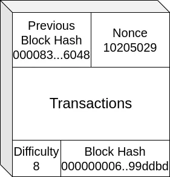

## What is the Lottery Mining

Have you ever heard about **Lottery Mining**?
Lottery Mining is a low-probability mining strategy, and with low I mean **VERY** low, to try to mine a block on **PoW blockchains**, such as Bitcoin.

To understand that, we first need to understand how mining in Bitcoin works.

### How Bitcoin Mining works

In blockchains such as Bitcoin, we know that with a certain interval of time, miners have to gather the transactions in the pool, put them into a block and calculate its hash.

A Hash is a sequence of number. between 0 and 255 and its represented in their hexadecimal representation, such as `3fc6cba4ec7329a78abbfaa59cd394a798fa33b876bf5d100b64b3faf1f70723`. In case of bitcoin which uses the **SHA256** hash algorithm, this sequence has 32 values.
The hash algorithm makes impossible to get the value which has generated the hash, and at the same time the hash between similiar values is totally different.

For example the sha256 of `jack` is `31611159E7E6FF7843EA4627745E89225FC866621CFCFDBD40871AF4413747CC`, while the sha256 for `lack` is `E3F315EA36ABCA8F80BE6AADBEA106FD32431242455FF6693C31B7BE1D07B18F`.

In the case of **Bitcoin**, to mine a block, the miners have to find a **Nonce** (a number), which values hashed with the transactions in the block and the hash of the last block in the blockchain, gives a hash which starts with a certain amount of **leading zeroes**.

The number of leading zeroes depends on the current difficulty, which is a parameters that is changed each **2016 blocks**, based on the current hashrate and the average time spent mining the last **2016** blocks.

This is important, because the more powerful the miner becomes, the higher the difficulty will be.



If we take for example the genesis block of Bitcoin, we can see it's hash is `000000000019d6689c085ae165831e934ff763ae46a2a6c172b3f1b60a8ce26f`.

So to wrap it up, **a miner is a machine that must be able to calculate a huge amount of hash per second** changing the nonce for each one. **The first miner able to find the nonce value, wins the block, and so a BTC reward**.

And so it's very easy for validators to verify the block, because they just need to check whether given the nonce and the block, hashing it (which takes less than a second), matches the current difficulty level.

### David and Goliath

Said that, in the past years the mining industry has seen many improvements on finding machines with a huge hash rate.
The **hash rate** defines how many hash a machine is able to calculate per second, in order to find the winning nonce.

At the beginning of Bitcoin, everybody used to mine on their scrap laptop, then, once Bitcoin mining became profitable, since the Bitcoin started to have a counterpart fiat value, group of people started to run mining farms with powerful computers with graphic cards, which was the best setup at the time.

Nowadays mining farms makes use of ASICs, which are integrated circuits designed specifically for bitcoin minings, which has a hash rate in terms of Tera Hash per second (TH/s).

The costs of mining farms and of course, electricity, has made bitcoin mining a business not for everyone, but just for a strict group of people, which can afford farms and low cost or self-produced energy.

This phenomenon has centralized Bitcoin mining, in contrary to the Bitcoin philosofy.


BUT, in the last few years, things have started to change with the development, first of [HAN from Valerio Vaccaro](https://github.com/valerio-vaccaro/HAN) and then with its improved version, the more famous [NerdMiner](https://github.com/BitMaker-hub/NerdMiner_v2).

These devices have become an interesting geek tools for solo miners, quite fun to place on your desk, but at the same time an army of little ants against the centralization of bitcoin mining.

These devices runs on ESP32, which is a micro-controller device with a very little hash rate capability, and run on **public pools**, which are coordinated Bitcoin mining pool setten up by volounteers. Everybody can partecipate to the pool connecting a miner and can be able to win a block. If you win the block, congratulations, you've won the current mining prize, which until April 2024 will be of `6.25BTC` and will become `3.125BTC` until the next halving.

I need to specify that the hashrate of a **NerdMiner** for example, is about 75KH/s, which is 75.000 Hash per second. An average miner ASIC may have 100 TH/s, which **is 100.000.000.000.000 Hash** per second.

### Why should I solo-mining

A good question that could raise at this point is _Why should I waste my time setting up a lottery miner then?_ and it is indeed a good question. As you can imagine the probability of winning the block is **much lower than winning the lottery**.

But yet, not impossible.

Furthermore, we should also consider the philosophical aspect of doing this: **decentralization** and **partecipation**.

The Bitcoin mining power, shouldn't be in the hand of a restrict group of people, but of the collectivity. And yes, you may think that a Nerd Miner won't make the difference, but it can actually does!
Let's take [Public-pool.io](https://web.public-pool.io/) for example, currently it runs 7713 Nerd Miner, 192 Bitaxe, 134 cpuminer and a few other devices and the pool hashrate is **587 EH/s** (ExaHash per second), which is a huge hashrate considering the devices running on it!

Partecipation in mining is important to **fight censorship on Bitcoin**, which could be caused by miners preventing certain transactions from being included in the blocks.

And then of course, you can play a very little amount of lottery tickets each 10 minutes and try to win some free Bitcoins, even if it happened a very little times.


## Viable options

If you're interested in finding out what are the current available solutions for lottery mining, let's see what options we have.

### Nerd Miner


The most famous one probably. It's hash rate is really poor, since it's just about 75KH/s, but is quite cool to have one on your desk, which shows the current Bitcoin price and block height. We could say it's more like a geek gadget, than a real mining solution, but I actually admit that I love it. It's totally open-source and can be found on different stores online. I got mine from [Satoshistore.io](https://satoshistore.io/) (no adv) for about 60€. Just for the records, currently in public pool there are more than 7.000 nerd miners active, and the total hash rate is about 500MH/s. Which yet, is very low, but it could become a huge army in the future.

### Raspberry Pi


The Raspberry Pi is still a viable option. I have two of them which I use for different purposes.
For instance my raspberry pi 5 is both a Bitcoin node and runs **cpuminer** on a single CPU core, which just for the record gives 6.4MH/s per core.

And I also have a very old Raspberry pi 2b device running just the **cpuminer** and has a hash rate of 1.4MH/s, which is ridicoulous compared to the Raspberry pi 5, considering my pi 2 runs the miner on all of its 4 cores, but it's very low-power, so it's not that bad.


#### Cpuminer setup

In order to setup cpuminer on the Raspberry pi, just follow these steps:

Get the cpuminer repository from Github

```sh
git clone https://github.com/tpruvot/cpuminer-multi.git
```

Install the dependencies with apt

```sh
sudo apt install -y automake autoconf pkg-config libcurl4-openssl-dev libjansson-dev libssl-dev libgmp-dev zlib1g-dev make g++
```

Build cpuminer

```sh
cd cpuminer-multi/
./build.sh
```

Link to /usr/bin

```sh
sudo ln -s $(pwd)/cpuminer /usr/bin/cpuminer
```

Run cpuminer

```sh
USERNAME="<your_bitcoin_address>.<worker_name>"
POOL_URL="stratum+tcp://public-pool.io:21496"
cpuminer -a sha256d -o "$POOL_URL" -u "$USERNAME" -p "x" -D -r 10
```

Now you should be able to see your worker on publicpool at web.public-pool.io/#/app/your_btc_address

### Bitaxe


For those who wants to go for a more performance-oriented solution, the [Bitaxe](https://bitaxe.org/) is a very good solution for solo mining. It's totally open-source, it has a hash rate of 500GH/s and consumes only 12W.

It costs around 200€/300€ and it looks really easy to setup.

## Feasability

Okay, but what is the feasability of winning a block with lottery mining? Well, let's say that as the name suggests it's really a lottery and you have to accept that, probably, **you'll never be able to win a block**.

Currently the bitcoin difficulty is 10, which means the first 10 bytes of the generated hash must be `0x00`. The probability of generating a random sha256 with this requirement is `8.27 * 10^-25` which is extremely low, so you can understand, it's very very very unlikely to happen.

### Someone did it

But someone actually did it. According to some stats, in 2023, one block per month was from a solo-miner.

## Private Pool

In case you want to setup your own private pool, you can follow this guide:

[How to setup a Bitcoin Solo Mining Pool](https://blog.veeso.dev/blog/en/how-to-setup-a-bitcoin-solo-mining-pool/)

## Conclusions

I think lottery-mining in public pool is a good practice to try to keep it more decentralized, and more people should join it.

I also think that if you have a SBC at your home which is not doing heavy work, such as my Raspberry, you could actually try with cpuminer.

The **NerdMiner** is a cool geek gadget, so it's cool to have one, but its hash rate is ridicoulous.

So I hope you join the lottery and have fun with it.
