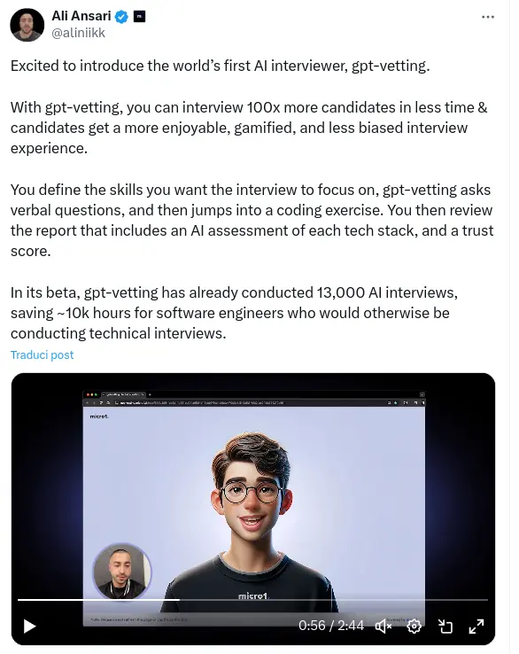

## A brief resume of how AI has taken over

If we went back to five years ago and you would have said "AI" in front of somebody, probably the first thought to come to minds would have been sci-fi, stupid NPCs in videogames or a bunch of ridicolous videos of robots tested in Japan doing weird stuff in TV.

But since the launch of ChatGPT in 2022 things have changed a lot.
Everbody suddenly started to talk about AI, everbody on Twitter began to sell courses to become an AI professionist and every people in the world started to talk about threatening of lose their job because of AI.

After almost two years, I can't deny ChatGPT and all the similiar products have played an important role in our lives. As a dev I've basically stopped using stack overflow in flavour of ChatGPT, and many others people have started using AI for several uses around the world.

Even if you don't know anything about AI and have never used ChatGPT before, you have come across its products for sure. It's enough to start watching videos on TikTok to find many videos making use of AI for the voicing or for the graphics, and now even for the video itself.

I'm not going to deny that **AI is cool**. We have answers to complex problems in a seconds, while before we had to browse for hours on forums to maybe find a solution.

We have the possibility to create logos and illustration, while before we had to pay for every damn stock image.

We have the possibility to have a voice-over for videos, while before we needed a voice actor.

**But at what cost?** And what are, in my opinion, the **worse products which we have implemented with the use of AI**.

## Willy's Chocolate Experience

Advertisement has started to make a massive use of AI, sometimes with the worst results.

Do we still remember the awful event of [Willy's Chocolate Experience](https://en.wikipedia.org/wiki/Willy's_Chocolate_Experience), where a massive use of AI has been put through to create the script for the show, which was absolutely garbage and the entire advertisement for the show, which made possible to transfor this

into this

And I know something can literally be advertised badly and scammy even without **AI, but now that is just making everything effortless**.

## Wish

And this effortlessy usage of AI is _maybe_ even hitting.

The recent release of Disney's "Wish" has sparked conversations not just for its storyline but also for its seemingly **uninspired songs**. Many speculate that the **banality** of the soundtrack could be attributed to AI involvement in the songwriting process, a move potentially driven by the ongoing **screenwriters' strike in Hollywood**. The strike has left a significant void in creative talent, leading studios to lean on artificial intelligence to fill the gap.

Clearly there is no proof that this is real, but the entire movie seems really too simple for the Disney standards, could AI be involved in the creation of it?

## Blogging hell

If you read a blog article in 2024, it's very like that it wasn't handwritten. That's true in particular for some kind of blogs, which are those focused on getting indexed on Google. Not mine, nobody reads my blog.

But everybody who owns a travel agency, a pet shop, a marketing agency now has a blog, and all the blogs article are 99% of the times written by AI. That's because they don't really give a sh\*t about writing a blog, but it's just related to the fact that google places you website higher in the search results based on the traffic you generate. So if your blog generates a lot of traffic with key words, your website gets traffic. But writing articles is a hustle, so let ChatGPT write it for you.

## GPT-vetting and Recruiting

And the grand finale **GPT-Vetting**!

I think this [tweet](https://twitter.com/aliniikk/status/1778796486194823514) is self explaining.

Are we really getting to the point companies don't want to give time to find a candidate for a position?

If you ever encountered a company using these tools, I strongly recommend you to not attend the interview by yourself, but let your AI generated avatar attend instead.
