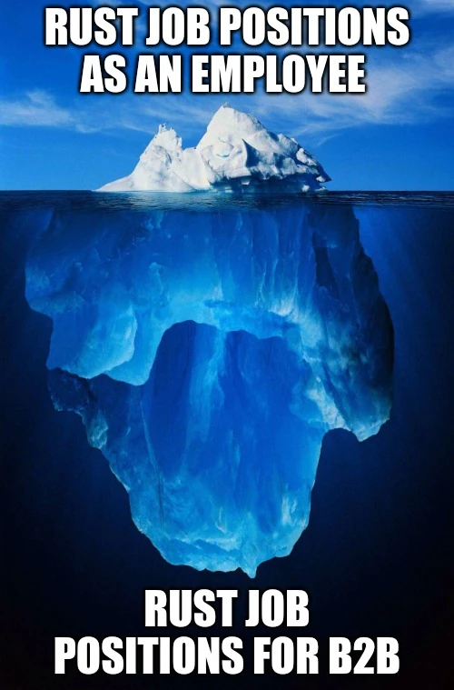

Nel 2023 ho deciso di dimettermi dal mio lavoro in Prima per cominciare a lavorare come freelancer, con un focus rivolto verso lo sviluppo Rust ed solo in piccola parte verso lo sviluppo Web. Attualmente posso affermare di lavorare **per il 90/95% del mio tempo su progetti Rust come freelance**. Ho però potuto notare come solo una minima parte, quasi nessuno, lavora come freelance in Rust, ed è davvero un peccato! Ma vediamo insieme perché.

## Come sono diventato un Rust freelancer

### Ero stanco del PHP

> È sempre colpa di **PHP**

Come amante di Rust, ho sempre sognato negli ultimi anni di poter lavorare con Rust a tempo pieno. Quando sono entrato in Prima nel 2021 ho avuto per la prima volta la possibilità di usare Rust a lavoro ed ero veramente contento, però purtroppo lo usavo solo per il 20-30% del tempo, insieme ad Elixir, Elm e sfortunatamente, PHP.

Non ho problemi a dire che Rust, almeno per me, è l'unico linguaggio di programmazione al mondo che mi permette di scrivere codice come nessun altro linguaggio. Mi dà uno strumento per scrivere codice pulito, affidabile e veloce per scrivere applicazioni di ogni tipo. Non avevo quindi interesse ormai nel lavorare con altri linguaggi. Volevo Rust per il 100% del mio tempo.

Come ogni buon italiano che si rispetti però, avevo paura di aprire la partita IVA, quindi preferivo il lavoro dipendente. Ma continuavo a ricevere un sacco di offerte su LinkedIn che assumevano come B2B (e obiettivamente pagavano il triplo di quanto prendevo prima), quindi ad una certa mi sono deciso di accetterne una, cominciando quindi la mia avventura come freelancer contractor.

### Da contractor a freelance

> Se lavori full time per un'azienda che ti ha assunto come B2B, non sei un freelance, ma sei un dipendente in partita IVA.

Dopo aver cominciato a lavorare in B2B, dentro di me è partito qualcosa che non avrei mai pensato di provare: lo spirito imprenditoriale. Avevo abbastanza tempo libero con il nuovo lavoro, quindi ho deciso di lavorare anche ad altro e ho cominciato a pubblicizzare la mia attività per sviluppo e design di siti web.

Ma non è andata troppo bene, non perché non faccia per me: mi diverte un sacco fare siti web, ma perché ci sono veramente troppi competitor ed il mercato è abbastanza saturo, se poi ci aggiungiamo che siamo in recessione e nessuno vuole più spendere un euro, ecco che finisci per spendere più in pubblicità su Google che quanto prendi dai progetti.

Avevo bisogno di qualcosa, di una **nicchia** e sapevo che **la mia nicchia era Rust**.

Quindi ho tirato su una campagna su Google Ads come **Rust Software Engineer** ed in pochi giorni con un budget ridicolo ho cominciato a ricevere **un sacco di proposte per piccoli progetti in Rust**.

## C'è una domanda gigantesca per gli sviluppatori Rust freelance

> Quindi non ci sono posizioni come sviluppatore Rust da dipendente, ma ce ne sono moltissime come freelance?

A quanto pare sì e ha pure perfettamente senso: **Rust è un linguaggio ancora nuovo per l'industria, che lo vuole ancora sperimentare**, probabilmente le aziende **stanno ancora considerando se adottarlo o meno** nei progetti a lungo termine. Le aziende non sono pronte per assumersi sviluppatori Rust full time, soprattutto in quei paesi dove il lavoro è particolarmente tutelato (come l'Italia), quindi **preferiscono provare con progetti più piccoli ed affidarsi sui freelance**.

Conosco io stesso aziende che stanno facendo una fatica assurda a trovare sviluppatori Rust in partita IVA, perché la maggior parte degli sviluppatori che vorrebbero passare a fare Rust full-time sono ancora incastrati in aziende a fare i dipendenti, spaventati dalla partita IVA.

### Non è tutto crypto, ma anche se fosse

Ho sentito un sacco di volte questa frase:

> Solo le aziendine che fanno crypto assumono sviluppatori Rust

E sì, ce ne sono un sacco ed io stesso ho lavorato e tutt'ora lavoro con alcune di esse, ma dire che ci siano solo aziende che fanno progetti su web3 vuol dire veramente cadere in un luogo comune.

Ho lavorato anche con diverse aziende in questo tempo che si occupavano di IoT, sviluppo embedded e servizi back-end con Rust, quindi non direi sia il caso di generalizzare.

**Il lavoro mica lo si deve sposare**. Non ci vedo niente di male nel lavorare in un'azienda che fa un progetto web3, anche se non credete in questo mondo. Io stesso non sono un credente della rivoluzione web3 di cui tanto si parla. Ho scritto papiri contro Bitcoin, ho criticato aspramente diverse blockchain e tutt'ora reputo che il 90% della roba su blockchain sia rumore e basta. Bisogna saper prendere questi progetti come esperienze formative e soprattutto come fonte di guadagno, visto che in genere pagano profumatamente. _L'importante è non partecipare a nessun progetto scam o simili._

## Dobbiamo parlare delle conferenze Rust

Prima di passare alle conclusioni, dobbiamo parlare delle conferenze di Rust.

In realtà questo problema riguarda un po' tutte le conferenze, quando si tratta di freelance che vogliono parteciparvi, e non solo quelle che riguardano Rust.

Allora, lo so che **le aziende hanno parecchi soldi da spendere in biglietti per i loro dipendenti**, quindi posso capire il prezzo più alto per scaricare l'IVA, **ma la maggior parte delle conferenze si è dimenticata dei lavoratori autonomi**.

Nella maggior parte dei casi non hai scelta tra **pagare come privato e spendere molti più soldi come "company" per scaricare l'IVA**.

Grazie a Dio, il problema è già stato tirato fuori e alcune conferenze hanno finalmente cominciato a mettere il biglietto per i freelance (kudos per [@eurorust](https://eurorust.eu/)), ma la gran parte ancora non lo fa (Non faccio nomi, ma pagare **270€ per un biglietto NON VA BENE né come privato, né come libero professionista**!)

## Conclusioni

Quindi penso veramente che se sei uno sviluppatore che vorrebbe lavorare su Rust full-time, ma non trovi posizioni, dovresti seriamentee considerare le posizioni B2B. E noi europei siamo veramente il fanalino di coda sui lavori in Rust, solo dopo agli Stati Uniti. La maggior parte dei lavoratori B2B su Rust viene dall'Africa o dall'Asia, tutto perché abbiamo paura di essere imprenditori di noi stessi e di questa benedetta partita IVA. Perché ti stai ancora torturando a lavorare con PHP?
