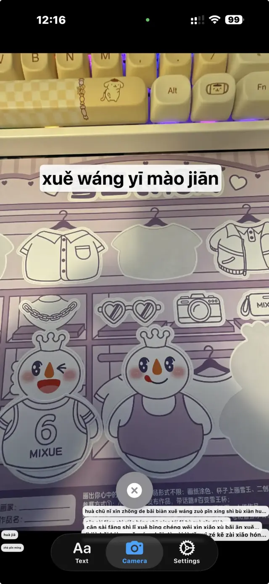

## Introduction

𰻝𰻝汉子 BiangBiang Hanzi is an iOS and Android application that allows users to convert Hanzi (Chinese characters) to Pinyin and translate Chinese text into any language. It supports both traditional and simplified Chinese characters and includes OCR capabilities for recognizing text from images, either live or from the camera.

This app has been developed using Swift and SwiftUI, leveraging the power of Apple's Vision framework for OCR functionality, while the Android version utilizes Kotlin and Jetpack Compose. The app is designed to be user-friendly, fast, and accurate, making it a valuable tool for language learners, travelers, and anyone needing quick translations.

## Why I Built This App

I developed this app to help myself and others learn Chinese more effectively by providing an easy way to read and understand Hanzi characters. It happened many times when I was in China in restaurants for example, I could not read the menu because I did not know how to pronounce the characters; but if I could know the pinyin I would have been able to read it out loud and order food. This app aims to solve that problem as well, aside from being a useful tool for learning Chinese in general.

Indeed unfortunately the system camera just provides translations, but not pinyin conversion, which makes quite difficult to order food in China for instance. So I thought it would be useful to have an app that could do just that.

## Features

- **Hanzi to Pinyin Conversion**: Instantly convert Chinese characters to Pinyin with tone marks.
- **Translation**: Translate Chinese text into any language using integrated translation services.
- **Camera OCR**: Use the device's camera to capture and recognize Chinese text in real-time.
- **Image OCR**: Select images from the photo library to extract and convert Chinese text.

### Cantonese Support

In the next updates, I aim to also provide support for Cantonese conversion, allowing users to convert Hanzi to Cantonese Romanization (Jyutping) as well. Of course Cantonese is more a niche language (for foreigners) compared to Mandarin, but still I think it would be a useful feature for those who want to learn Cantonese or travel to Cantonese-speaking regions, like Hong Kong.

Unfortunately, there is not direct support for Cantonese by iOS and Android system libraries, so I will need to rely on third-party libraries or APIs to implement this feature. I am currently researching the best options available to ensure accurate and reliable Cantonese conversion.

## Text Conversion

The first screen of the app allows users to input Chinese text manually or paste it from the clipboard. Once the text is entered, the pinyin conversion is displayed instantly below the input field. Users can also tap a button to translate the text into their desired language.

The translation feature requires to install the system language packs.

## Camera OCR

The app's camera OCR feature enables users to point their device's camera at Chinese text, such as signs, menus, or documents. The app recognizes the text in real-time and displays the converted pinyin and translation on the screen.

By clicking on the captured text, users can copy the pinyin to the clipboard for easy sharing or further use.

It is also possible to toggle pinyin conversion, so that you can just copy the hanzi if you want.

Additionally, users can select images from their photo library to extract and convert Chinese text.

Unfortunately on iOS, the position of the text boxes is not always perfectly aligned with the actual text in the camera view, due to some limitations of the Vision framework. However, the OCR accuracy is still quite good, and the app performs well in various lighting conditions.

Unexpectedly, the Android version seems to have a better text box alignment, probably due to differences in the underlying OCR libraries used by each platform.

## Conclusion

𰻝𰻝汉子 BiangBiang Hanzi is a powerful and user-friendly app for converting Hanzi to Pinyin and translating Chinese text. Its OCR capabilities make it a versatile tool for language learners and travelers alike. With ongoing development, including plans for Cantonese support, this app aims to be an essential companion for anyone engaging with the Chinese language.

I hope the next time you are in China or a Chinese-speaking region, this app will help you read menus and signs more easily! Enjoy your 奶茶！

The app is open source, and you can find the code on [GitHub](https://github.com/veeso/BiangBiang-Hanzi), but mind that is licensed under a **Elastic v2 license**, which is not a permissive license. You can indeed use it for free, but there are some restrictions, especially if you plan to redistribute it or use it in a commercial product. Please check the license for more details.

You can buy the app on the [App Store](https://apps.apple.com/app/id6754869174) and [Google Play Store](https://play.google.com/store/apps/details?id=dev.veeso.biangbianghanzi).

 
