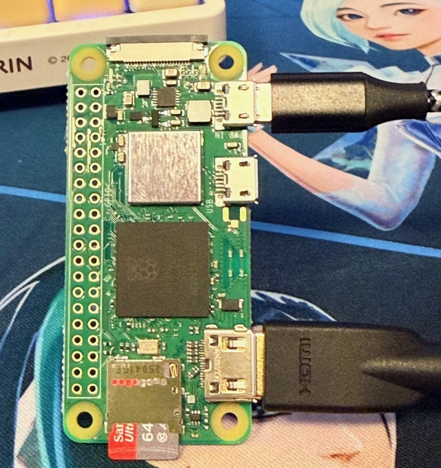

Since I saw the [Lego Gameboy set](https://www.lego.com/product/game-boy-72046), I wanted to make it functional since I have good knowledge of programming and little knowledge of electronics.

Also I've been a big fan of Gameboys since I was a kid, so I thought it would be a fun project to combine my love for Lego and Gameboys.

Recently a Kickstarter project called [Brickboy](https://www.kickstarter.com/projects/brickboy/brickboy-the-kit-that-makes-the-lego-game-boy-come-alive) has been launched, which provides a kit to make the Lego Gameboy functional.

However, I decided to take on the challenge of creating my own version of a working Gameboy Color using the Lego Gameboy as a base.
Also, if as me you want to have fun building things youself, it is better to not use a ready-made kit, also to save a lot of money.

In this article I will go through all the steps I took to transform my Lego Gameboy into a working Gameboy Color.

## Premise

**This project is just frustrating enough to be fun**, but not too hard to be impossible.

Honestly, if you don't feel comfortable with these kind of projects, either buy the Brickboy kit or just build the Lego Gameboy as it is, it's already a great model.

And I want to say the hardest part of this project is not about the electronics, but about the software configuration. Even if here I've provided a step-by-step guide, it's going to work only if you install the same versions as I did and buy the exact same components; which by the way will never happen, so be ready to troubleshoot a lot of things.

Most of the displays won't work with tftfb, the emulation is a nightmare to build from source, and the debian packages gets deprecated every day.

You are warned. Also, consider that this article is relatively short, but I spent **several days** to make everything work and many nights troubleshooting issues.

## Parts Used

- The [Lego Gameboy set](https://www.lego.com/product/game-boy-72046) (of course). Remember not to build it yet.
- A Raspberry Pi Zero 2W (with header pins soldered on)
- A 64GB microSD card (any size above 16GB should work)
- A Micro USB to USB-A adapter to power the Pi
- A 2.4" LCD IPS display 320x240 with SPI interface.
- 8x tactile push buttons
  - For D-PAD use **4 6x6x5mm buttons** (the height is very important, otherwise the D-PAD won't fit or won't press the buttons).
  - For A, B, START, SELECT use **4 6x6x4.3mm buttons**
- For Audio: MAX98357 + 8Ohm 1W Speaker
- A USB C panel mount to plug a USB-C power cable into the Lego Gameboy
- A cut micro USB cable to solder on the USB-C panel mount

Also, I strongly recommend getting a **Breadboard to first prototype** the connections before soldering everything together.

Premise: I am terrible at electronics, so I probably made some mistakes in the wiring, but in the end it worked out fine.

## Raspberry Pi Setup

### Flashing the OS

For this mod I'm using the Raspberry OS with Debian **Bookworm** Lite base **32 bit** with RetroPie installed on top.

Trixie is not supported by RetroPie yet.

I know there is the RetroPie image available for Raspberry Pi, but the firmware doesn't come with support for fbtft displays, so I preferred to start from the Raspberry OS base image.

You can use the [Raspberry Pi Imager](https://www.raspberrypi.com/software/) to flash the RetroPie image to the microSD card.

Also set the parameters for WiFi and SSH access in the imager settings before flashing.

Once you have flashed the image, eject and then re-insert the SD card to your computer to access the "boot" partition.

### Initial Boot and SSH Access

At this point, safely eject the microSD card from your computer.

The reason I'm not configuring the device with a keyboard is that the Pi Zero 2W has only micro usb ports, and I really don't have an adapter to connect a keyboard to it (Didn't EU make us all use USB-C by now???).

Insert the microSD card into the Raspberry Pi Zero 2W and power it on using the Micro USB to USB-A adapter connected to a power source.

At this point we're going to do some initial setup, so connect the Mini HDMI to HDMI adapter/cable to a monitor.



When the RetroPie boots up, check the screen to find the IP address assigned to your Pi by your router (you'll need it to connect via SSH).


Once it's booted up, connect to the Pi via SSH using a terminal (on Linux or Mac) or an SSH client like PuTTY (on Windows).

The credentials are:

- Username: `pi`
- Password: `raspberry`

Let's connect via SSH

```bash
ssh pi@YOUR_PI_IP_ADDRESS
```

and immediately change your password with `passwd`.

Now I also want to set a static IP address for easier access in the future.

To do so, edit the `dhcpcd.conf` file:

```bash
sudo nano /etc/dhcpcd.conf
```

and paste:

```txt
interface wlan0
static ip_address=YOUR_IP_ADDR/24
static routers=YOUR_ROUTER_IP
static domain_name_servers=YOUR_ROUTER_IP 1.1.1.1 8.8.8.8
```

Finally reboot:

```bash
sudo reboot
```

Now we can re-connect via SSH using the static IP address we just set and continue with the setup.

We need to enable the SPI interface for the LCD display.

```bash
sudo raspi-config
```

Go to `3. Interface Options` -> `P4 SPI` and say `Yes` to enable it.

Finally, go to `8. Update` to update the raspi-config tool itself.

## GPIO Mapping

So let's start by mapping the GPIO pins for the buttons and the display.

This is the pinout for the Raspberry Pi Zero 2W:


### LCD Display ST7789 (SPI0)

```txt
| Use  | GPIO (BCM) | Note                                             |
|------|------------|--------------------------------------------------|
| VCC  | PIN 1      | 3.3V                                             |
| GND  | PIN 9      | GND                                              |
| DIN  | GPIO10     | SPI0 MOSI                                        |
| SCK  | GPIO11     | SPI0 SCLK                                        |
| CS   | GPIO8      | SPI0 CE0 (This display actually did not have it) |
| DC   | GPIO25     | GPIO                                             |
| RST  | GPIO27     | GPIO                                             |
| BL   | PIN 17     | 3.3V, Always ON                                  |
```

### Buttons

#### D-Pad

```txt
| Button | GPIO   |
|--------|--------|
| UP     | GPIO5  |
| DOWN   | GPIO6  |
| LEFT   | GPIO13 |
| RIGHT  | GPIO16 |
```

#### Action Buttons

```txt
| Button | GPIO   |
|--------|--------|
| A      | GPIO17 |
| B      | GPIO22 |
| START  | GPIO23 |
| SELECT | GPIO24 |
```

### Shutdown

```txt
| Use             | GPIO   |
|-----------------|--------|
| Shutdown (soft) | GPIO26 |
```

### Audio - MAX98357

```txt
| Use             | GPIO      | Note     |
|-----------------|-----------|----------|
| ViN             | 5V Power  | 5V       |
| BCLK            | GPIO18    | PCM CLK  |
| LRC             | GPIO19    | PCM FS   |
| DIN             | GPIO21    | PCM DOUT |
| SD              | GPIO12    | Shutdown |
| GND             | GND       |          |
```

## Wiring the Components

Here is a wiring diagram showing how to connect all the components to the Raspberry Pi Zero 2W:


## Audio Setup

First of all we need to enable the I2S interface for the audio.

```bash
sudo nano /boot/firmware/config.txt
```

Add the following lines at the end of the file:

```txt
dtparam=i2s=on
dtoverlay=max98357a

# enable gpio 12 for audio
gpio=12=op,dh
```

Then reboot

```bash
sudo reboot
```

Now you can test the audio:

```bash
aplay -l
```

You should see the `HiFiBerry DAC` listed.

```txt
**** List of PLAYBACK Hardware Devices ****
card 0: MAX98357A [MAX98357A], device 0: bcm2835-i2s-HiFi HiFi-0 [bcm2835-i2s-HiFi HiFi-0]
  Subdevices: 1/1
  Subdevice #0: subdevice #0
```

Then you can test audio playback with:

```bash
speaker-test -D hw:0,0 -c 2 -t pink
```

Finally set the audio output to the MAX98357:

```bash
sudo nano /etc/asound.conf
```

```txt
pcm.!default {
    type plug
    slave.pcm "hw:0,0"
}

ctl.!default {
    type hw
    card 0
}
```

## Configuring the LCD Display

Unfortunately, there is no way to use the framebuffer directly with the ST7789 display, so we need to copy the RetroPie image to the display.

This is not great, but I haven't found a better solution yet.

Open the `/boot/firmware/config.txt` file again:

```bash
sudo nano /boot/firmware/config.txt
```

and **add** the following lines at the end of the file:

```txt
# SPI LCD Display
dtoverlay=fbtft,spi0-0,ili9341,bgr,rotate=270,reset_pin=27,dc_pin=25
```

then **remove** the following lines if present:

```txt
dtoverlay=vc4-fms-v3d
max_framebuffers=2
```

## Emulation Setup

At the beginning I opted for RetroPie, but actually it's a mess and I regret it. Indeed it work only on a very old version of Raspberry OS, and the setup is a nightmare, also it's overkill for just a Gameboy Color emulator.

I tried **EmulationStation** and **Pegasus Frontend**, and I couldn't get none of them to work.

I even tried using `mgba` and `gambatte` emulators directly, but there's no way to use the framebuffer.

The only solution I could come up with is to use a fork of `rboy` I've created called [`rboy-legogb`](https://github.com/veeso/rboy-legogb),
which is a modified version of `rboy` that reads input from GPIO pins and outputs video to the framebuffer. Also it comes up with a very simple ROMs browser.

Just scroll with the D-Pad and press START to start a game.

Now let's install it:

```bash
sudo apt install -y libasound2-dev
cd /tmp
wget -O rboy-legogb.tar.gz "https://github.com/veeso/rboy-legogb/releases/download/v0.2.1/rboy-legogb-0.2.1-aarch32-linux.tar.gz"
```

Then extract it and move the binary to `/usr/local/bin`:

```bash
tar -xvf rboy-legogb.tar.gz
sudo mv rboy-legogb /usr/local/bin/rboy-legogb
sudo chmod +x /usr/local/bin/rboy-legogb
```

now configure `rboy-legogb`:

```bash
sudo mkdir -p /etc/rboy-legogb
sudo nano /etc/rboy-legogb/config.toml
```

and paste the following content:

```toml
roms_directory = "/home/pi/roms"
default_debounce_ms = 50
default_active_low = true
poll_interval_ms = 10

# D-Pad

[[key]]
gpio = 5
keycode = "UP"
repeat = true
repeat_delay_ms = 300
repeat_rate_ms = 80

[[key]]
gpio = 6
keycode = "DOWN"
repeat = true
repeat_delay_ms = 300
repeat_rate_ms = 80

[[key]]
gpio = 13
keycode = "LEFT"
repeat = true
repeat_delay_ms = 300
repeat_rate_ms = 80

[[key]]
gpio = 16
keycode = "RIGHT"
repeat = true
repeat_delay_ms = 300
repeat_rate_ms = 80

[[key]]
gpio = 17
keycode = "A"
repeat = false

[[key]]
gpio = 22
keycode = "B"
repeat = false

[[key]]
gpio = 23
keycode = "START"
repeat = false

[[key]]
gpio = 24
keycode = "SELECT"
repeat = false

[[powerswitch]]
gpio = 26
```

At this point enable the `rboy` service on boot:

```bash
sudo nano /etc/systemd/system/rboy-legogb.service
```

```ini
[Unit]
Description=LEGO GameBoy
After=local-fs.target
Requires=local-fs.target

[Service]
Type=simple
ExecStart=/usr/local/bin/rboy-legogb
WorkingDirectory=/root
User=root
Group=root
Restart=always
RestartSec=1

Environment=RUST_BACKTRACE=1
Environment=TERM=dumb

StandardInput=null
StandardOutput=journal
StandardError=journal

[Install]
WantedBy=multi-user.target
```

> If your display has different size from mine, you can modify the service by adding the `--width` and `--height` parameters to the `ExecStart` line.

and enable it:

```bash
sudo systemctl enable rboy-legogb.service
```

### Uploading ROMs

You can now upload your Gameboy ROMs to the Raspberry Pi at `/home/pi/roms`.

You can upload ROMs via SFTP using an SFTP client, but I suggest you use [termscp](https://github.com/veeso/termscp), so you can upload files directly from your terminal with a fancy user interface.

Remember that only `.gb` and `.gbc` ROMs are supported.

Once it's done, reboot the system:

```bash
sudo reboot
```

### It's Alive

Once the system reboots, you should see the `rboy` interface on the LCD display and you should be able to navigate the ROMs with the D-Pad and start a game with the START button.


Once selected a game the game should run perfectly!

<iframe width="100%" height="720" src="https://www.youtube.com/embed/7QqFol7MKCI" title="First boot of rboy legogb" frameborder="0" allow="accelerometer; autoplay; clipboard-write; encrypted-media; gyroscope; picture-in-picture; web-share" referrerpolicy="strict-origin-when-cross-origin" allowfullscreen></iframe>

## Fitting Everything Inside the Lego Gameboy

Complete both part 1 and part 2 of the Lego Gameboy instructions.

This will be the outer shell of the Gameboy after completing the first two parts:


Now we can start part 3, and I will tell you below the steps where to stop and fit stuff inside.

> Do not prepare the GND daisy chain before placing the buttons, my advice is to place the buttons with the wired soldered, one for GND and one for the signal, then solder all the GND wires together later, inside of the case.

### Fitting SELECT and START Buttons

Skip **step 68**, then cut two rows from the plate below START and SELECT, in order to make space for the buttons.


Then glue the two buttons on the green plate below, where the green plate should have been, but now it's removed.

At step 79, they should be in the middle between the two grey triangles.

Go to step 108, and check whether they click properly.

### Fitting the D-Pad

Skip **step 58**.

After completing **step 76** of the instructions, stop.

Do not place the **red 4x2 block**, instead place a **2x1** block at top left.

At step 78, do not place the **3x1 green block**, instead place two **1x1 blocks** leaving a space in the middle.

At this point you can glue the D-Pad buttons where the green cones should have been.

Then continue and fit the D-Pad in the case.

### Fitting A and B Buttons

Just put the buttons immediately below the LEGO buttons, they should fit perfectly and work fine.

### Fitting the Display and the Raspberry Pi

Just fit the display and the raspberry Pi behind the screen opening, then build a back mod with some extra grey LEGO pieces to hold everything in place; place the speaker as well, because unfortunately they didn't open the grid of the speaker in the original model.

### Fitting the Power Connector

Instead of placing the contrast knob, just place the USB C panel there; it has the same size and it fits perfectly.

Et voilà, your LEGO Gameboy is now a fully functional Gameboy Color!

## Final Thoughts

If I had to define this project with a word, that would be **suffering**.

Really, this project is a pain, and the risk of failure is quite high; I even scorched my LEGO set with a soldering iron at some point and indeed it has visible melted plastic parts.

Also, half of the components I've used, were not of the correct size, so I had to improvise a lot of stuff and replace many of them.

If I had to do it again from scratch, I would do it smoothly and the result would be way better. But hey, I really don't want to buy another LEGO Gameboy set just to redo the project.

Also, I would say it's quite expensive as a project, considering that the LEGO set itself costs around 60€, and the Raspberry Pi Zero 2W costs around 15-20€, plus all the other components.

At that price you could just buy a second-hand Gameboy Color, not kidding.
