## Preamble

In June 2025, I attended the World Computer Conference in Zurich, the main conference on the Internet Computer.

> The **Internet Computer** is a distributed cloud computing platform where you deploy your backend as **WebAssembly** modules, called canisters, that run across a network of independent data centres worldwide.

I’ve worked on the Internet Computer ecosystem for 3 years so far, and I’ve always liked it and its potential. After attending the conference, I had many projects in mind, including implementing **Mastic**.

## What is Mastic?

Mastic is a **Mastodon** instance built in Rust, running entirely on the Internet Computer as Rust WASM canisters.

Mastic is actually a federated social platform, fully compatible with Mastodon and the wider Fediverse via ActivityPub.

The goal is to bring the Fediverse natively onto the Internet Computer, giving anyone the possibility to run their own Mastodon node instance with no external infrastructure (no PostgreSQL, Redis, Nginx, etc), and interact seamlessly with existing Mastodon instances, while benefiting from IC scalability, the Internet Identity authentication, and decentralised governance through an SNS-based DAO.

The project will come with a deployed instance at <https://mastic.social>.

### Architecture

The big picture looks like this:

| Component               | Role                                                                                                                                  |
| :---------------------- | :------------------------------------------------------------------------------------------------------------------------------------ |
| **Directory Canister**  | Global registry. Maps Internet Identity principals to handles and User Canister IDs. Manages sign-up, profile deletion, moderation.   |
| **Federation Canister** | HTTP boundary. Handles all server-to-server ActivityPub traffic, serves WebFinger, routes activities between local users and remotes. |
| **User Canister**       | One per user. Stores inbox, outbox, profile, followers, following. Holds the RSA keypair used for HTTP Signatures.                    |
| **Frontend**            | React-based frontend, serving the user interface and interacting with the canisters through the IC's JavaScript agent.                |

When a user signs up, they go through the Directory Canister, which, on sign-up, triggers the creation of a canister for the user. Once set up, users will interact directly with their user canister for most operations. User canisters then forward activities using the ActivityPub protocol to the federation canister, which will both dispatch activities to the other user canisters and to external fediverse instances.

To make it concrete, here’s what happens when Alice publishes a status with one local follower (Bob) and one remote follower (Carol on a Mastodon instance):

The same Federation Canister handles both paths, the only difference is that the local hop stays inside the IC, while the remote one goes out as standard ActivityPub over HTTP with HTTP Signatures.

### Why It Matters

Mastodon popularised the Fediverse, but its Ruby on Rails monolith, plus PostgreSQL, Redis, Sidekiq, and friends, makes self-hosting an ops burden.

Reimagining an ActivityPub-compatible server as autonomous Rust canisters removes that burden entirely:

- Fully distributed: no external infrastructure, no DevOps.
- Per-user isolation: each user lives in their own canister, scaling horizontally by design.
- Internet Identity: bringing IC-native authentication to the Fediverse.
- DAO-governed: moderation, upgrades and federation policies handled by the SNS, not a single instance admin.

### Delayed development

You may wonder what happened between the conference in June and March, which is when I finally started working on Mastic.

Well, while I wrote the architecture on the journey home (which took 10 hours), unfortunately, for both business and technical reasons, the implementation didn’t start until March 2026.

On the business side, there were two problems. The hub I was working with didn’t want to invest in a project with no clear profitability, even though the impact on the ecosystem would have been very positive. On top of that, the foundation behind the Internet Computer cut off most of the funding for independent developers, which made it even harder to justify the time.

There was also a technical reason behind the delay: relational databases.

## Relational Databases on WASM runtimes

### Why it’s hard to run relational databases on WASM

In recent years, you have heard many times about WASM applications, but you may not know that one of the biggest issues with them is the lack of relational databases. There are basically two reasons.

The first is that porting an existing DBMS to WASM is painful. Engines like SQLite, PostgreSQL or MySQL are written assuming a real OS underneath: threads, file descriptors, memory mapping, signals, fsync semantics, sometimes raw block devices. WASM gives you none of that out of the box. You get a single-threaded sandbox with linear memory and a small set of host imports. SQLite has been compiled to WASM, but only by emulating a virtual filesystem (typically in IndexedDB or OPFS in the browser, or in stable memory on the IC), and it gives up most of its concurrency story in the process. Anything bigger than SQLite is realistically a non-starter today.

The second is WASI. WASI is the standard set of host bindings WASM uses to talk to the outside world (filesystem, sockets, clocks, random, and so on), and it’s the natural target you would want a database to compile against. The problem is that WASI is still incomplete and slow for database workloads. There’s no stable threading proposal yet, no good async IO story, no real `mmap`, and `fsync` semantics depend entirely on the host. Even when it works, every syscall crosses the WASM/host boundary, which kills throughput on workloads that do a lot of small reads and writes, exactly what a database does. The IC makes this even more specific: there is no filesystem at all, only stable memory, so you can’t even pretend to be running on a normal POSIX-like system.

The combined result is that, until recently, "relational database on WASM" basically meant "SQLite in a browser tab", which is fine for a notes app but not for anything resembling a backend.

### The advent of wasm-dbms

This wasn’t only a WASM ecosystem problem, it was also an Internet Computer problem. Many projects on the IC ended up being declared infeasible just because there was no decent relational store, and almost any non-trivial backend ends up wanting one eventually. That’s why in November 2025, I decided to finally tackle [wasm-dbms](https://github.com/veeso/wasm-dbms): a relational DBMS designed from day one for WASM and stable memory, instead of being a port of something built for Linux.

It’s been an intense period of development and a lot of sacrificed spare time, but after 6 months I can say wasm-dbms is finally capable, quite stable and reasonably performant (even if there’s still a lot of work to do on the performance side).

With wasm-dbms ready for production, I was finally able to resume working on Mastic.

## Is it a Rust Mastodon implementation?

Technically, yes. Mastic is going to be fully compatible with the Mastodon API and ActivityPub surface, and it’s written entirely in Rust, so you can think of it as a Rust rewrite of Mastodon, just one that happens to live on the Internet Computer instead of a Rails server.

That said, you can’t take the current codebase and drop it on a traditional VPS as-is. Mastic is built on top of `ic-cdk`, stable memory, and the canister model: things like timers, persistence, inter-canister calls and HTTP outcalls all go through IC-specific APIs. Replacing them with the equivalent traditional stack (axum or actix for HTTP, tokio for async, PostgreSQL or SQLite via wasm-dbms or a direct driver for storage, a real job runner for delivery) is a porting job, not a one-line config change.

The good news is that the codebase has been deliberately structured to keep that door open. The protocol code (ActivityPub types, HTTP Signatures, WebFinger, the federation logic) lives in plain Rust libraries with no IC dependencies, so it’s reusable as-is. The canister code is mostly a thin orchestration layer on top of those libraries. In practice, porting Mastic to a traditional axum/tokio application means rewriting that orchestration layer and swapping the storage backend, while the bulk of the protocol implementation stays untouched.

So Mastic is not "a Mastodon server you can `docker run`", but it is a Rust implementation of Mastodon-compatible federation that, with some work, could become exactly that.

## Roadmap

The project is split across five milestones:

- [x] **M0 - Proof of Concept** (done): a minimal social platform with sign-up, status posting, follows and a basic feed, all running on a single Mastic node. This was mostly about validating the canister architecture and making sure wasm-dbms could actually carry the persistence layer in production.
- [ ] **M1 - Standalone Mastic Node** (due August 2026): all the remaining local-node features, including profile updates and deletion, status interactions (like, boost, delete), user search and basic moderation. Once this is done, Mastic is a fully usable social network within a single node, ready for federation.
- [ ] **M2 - Frontend** (due October 2026): a React frontend served as an IC asset canister, with Internet Identity authentication and a Mastodon-like interface covering everything from M0 and M1.
- [ ] **M3 - Integrating the Fediverse** (due December 2026): the actual Federation Protocol, so remote Mastodon instances can discover Mastic users via WebFinger, fetch actor profiles and exchange activities over HTTP using ActivityPub and HTTP Signatures. After this, Mastic users can talk to any Mastodon instance and vice versa.
- [ ] **M4 - SNS Launch** (due January 2027): Mastic goes on the Service Nervous System, with token holders voting on moderation, policy changes and canister upgrades. This is what makes the project actually decentralised, not just distributed.

You can follow the progress directly on the [GitHub milestones page](https://github.com/veeso/mastic/milestones).

## Conclusion

Mastic is the project I've wanted to build for a long time, and after a pretty long detour through wasm-dbms, it's finally happening. The PoC is already up, and the path to a fully federated, DAO-governed Mastodon node running entirely on the IC feels concrete now, not theoretical.

I think the combination of ActivityPub, per-user canisters and SNS governance is genuinely something the Fediverse doesn't have yet, and I'm curious to see how it behaves once real users are on it.

If you're into the Fediverse, the Internet Computer, or just curious about running social platforms without the usual ops stack, give the [repo](https://github.com/veeso/mastic) a star and watch the milestones. Contributions, issues and feedback are very welcome, and once <https://mastic.social> is live, I'd love to see you over there.

## References

- [Mastic GitHub Repository](https://github.com/veeso/mastic)
- [Mastic Documentation](https://docs.mastic.social)
- [wasm-dbms GitHub Repository](https://github.com/veeso/wasm-dbms)
- [Internet Computer](https://internetcomputer.org/)
- [Mastodon](https://joinmastodon.org/)
- [ActivityPub](https://www.w3.org/TR/activitypub/)
