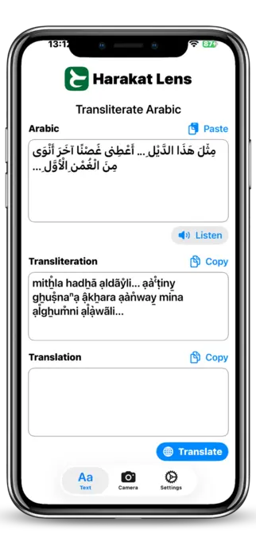
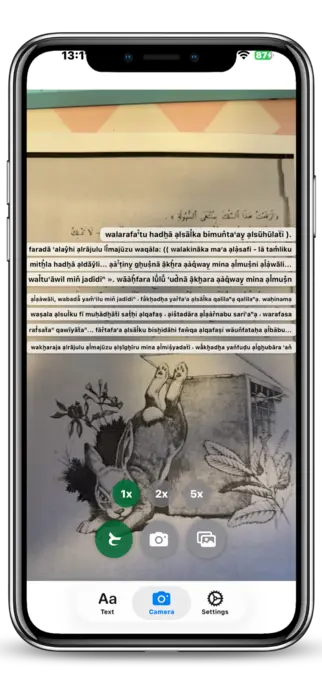
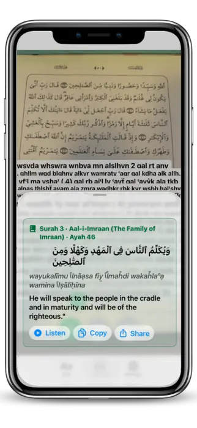

## Preamble

A few months ago I shipped [BiangBiang Hanzi](https://biangbianghanzi.app/), an iOS and Android app that points your camera at Chinese characters and gives you back the Pinyin (or Jyutping) plus a translation. The motivation back then was very practical: I'd been to China and couldn't read most of the menu at the time, even for dishes I knew how to pronounce. I was a beginner in Chinese, so I still didn't know most of the characters.

Once that pipeline existed (Vision OCR, on-device romanization, on-device translation, a clean SwiftUI camera flow), porting it to a different script was almost free. The hard architectural decisions were already made, the OCR plumbing was already there, the translation layer was already wired up. What was left was mostly "swap the language pack and the romanization rules".

Arabic was the obvious next target. It's one of the most read scripts on earth, it's notoriously hard to approach for non-native speakers (letters that change shape, vowels that are usually missing, right-to-left reading order), and on top of that it has a huge dedicated audience in **Quran readers**, who often want to read or recite text they can't fully decode on their own. Same problem as the Chinese-menu-in-Xi'an scenario, different alphabet, much bigger audience.

So I built **Harakat Lens**, an iOS app that points your camera at any Arabic text and reads it back in Latin transliteration, plus a translation, in a fraction of a second. It works on generic Arabic and on Quranic Arabic, with a dedicated mode that recognises ayahs and plays the recitation.

The app is now [available on the App Store](https://apps.apple.com/app/id6767614189), and the source is on [GitHub](https://github.com/veeso/Harakat-Lens) under the Elastic V2 license.

## Read Arabic instantly

The core idea of Harakat Lens is simple: you should not need to read the Arabic alphabet to read Arabic. The app takes any chunk of Arabic script, in any font, in any direction, and gives you back three things at once:

- the original Arabic text, cleaned up;
- a Latin **transliteration** so you can pronounce it;
- a **translation** into the language you choose (English, Italian, French, and so on).

The transliteration is the part that matters the most for learners. If you're a beginner, you usually know more spoken Arabic than you can read, so seeing `bismi llāhi r-raḥmāni r-raḥīm` next to بِسْمِ اللَّهِ الرَّحْمَٰنِ الرَّحِيمِ unlocks the text immediately. For travelers it's even simpler: you just want to know what that sign at the airport actually says, and you want it in two seconds, not after a five-minute Google Translate dance.

Translation is implemented on top of Apple's on-device translation framework when available, with a remote fallback for languages the device doesn't ship locally. Transliteration runs fully on-device.

## Point. Scan. Read.

Harakat Lens has three input modes, and they all end up in the same pipeline:

1. **Live camera OCR**: open the app, point it at the text, and the recognition runs in real time on the camera feed. No need to take a picture, no need to crop.
2. **Photo capture**: if the lighting is bad or the text is far away, you take a single photo and the OCR runs on the still frame.
3. **Image import**: any image from your Photos library or shared from another app (Safari, Messages, a PDF page) goes through the same OCR.

Under the hood, all three modes feed into Apple's Vision framework with a custom Arabic-tuned configuration. The output is then normalised, segmented and sent to the transliteration and translation stages. The whole pipeline is designed to be **fast enough to feel live**, which on Arabic script is harder than it sounds (more on that in the technical section).

The UX is intentionally minimal: one screen, one button, the result on top of the camera view. No menus, no settings to tweak before you can use it. You point, you scan, you read.

## Explore Quran Verses

The second mode is the one I personally use the most: **Quran mode**.

When you scan Arabic text in Quran mode, Harakat Lens doesn't just OCR it, it tries to **match the recognised text against the canonical Quran corpus**. If it finds a match, you get the structured metadata of the verse: surah name and number, ayah number, the reference you'd cite in any Quran study app. From there, two things happen:

- the **transliteration uses the Quranic standard**, with proper handling of harakat, shaddah, sukun, and the special signs that only appear in Quranic text;
- you get **audio playback of the recitation** for the matched ayah, streamed from <https://everyayah.com>, which hosts a large archive of recitations from many qaris (reciters).

This means you can take any Quran, mushaf or printed page, point the camera at any line, and instantly hear that exact ayah recited, while reading both the Arabic and the transliteration. For someone learning to recite, or for anyone who wants to verify their own pronunciation against a reference, that loop (see, read, hear) is the whole point.

For non-Quranic Arabic, the app still gives you audio, but through **on-device text-to-speech** instead of recitation. It's not a qari, but it's good enough to learn how a sentence is supposed to sound, and it works offline.

## Technical challenges

Building this app sounded straightforward on paper. In practice, two parts gave me the most trouble: **Arabic vowels** and **Quran audio playback**.

### Vowels (harakat) and OCR

Arabic, as written in the wild, is mostly **unvocalised**. Newspapers, road signs, books, menus, all of them drop the short vowels (the harakat) and trust the reader to fill them in from context. That's fine for a fluent reader, but it's a disaster for a transliteration engine, because `كتب` can be `kataba` (he wrote), `kutiba` (it was written), `kutub` (books), or `kutubun` (books, indefinite), and they're all spelled identically without harakat.

Quranic text is the opposite: it's **fully vocalised**, with extra signs (madda, shaddah, sukun, small alif, hamzatul wasl) that don't appear anywhere else. So Harakat Lens has to deal with two very different inputs, on the same OCR pipeline:

| Input          | Harakat present  | Strategy                                                                |
| :------------- | :--------------- | :---------------------------------------------------------------------- |
| Generic Arabic | rarely / partial | infer harakat from a morphological model, then transliterate            |
| Quranic Arabic | always, dense    | trust the harakat as-is, but keep the OCR robust to tiny diacritic dots |

The OCR side was the painful one. Vision's Arabic recogniser, like most OCR engines, is tuned for the unvocalised case, and it tends to either drop harakat entirely or merge them into the wrong letter. I ended up running a second pass specifically on the harakat layer (small connected components above and below the baseline) and stitching the result back into the main token stream. It's not perfect, but it raised the Quran-mode recognition rate from "almost unusable" to "actually shippable".

There's also the bidirectional text problem. Arabic is right-to-left, but numbers, Latin words and punctuation inside the same line are left-to-right, and OCR engines love to scramble the order. Most of the post-processing in the app is just **un-scrambling that order** before feeding the text to the transliterator and the Quran matcher.

### Quran playback

The Quran playback feature looks like a one-liner ("just play the matching audio"), but it has three moving parts that all have to agree.

The first is **canonical matching**. EveryAyah indexes audio by `(surah, ayah)`, but my OCR gives me a string of Arabic, sometimes with errors, sometimes with extra harakat that don't match the canonical Uthmani text byte-for-byte. So I had to build a tolerant matcher: normalise the OCR output (strip optional diacritics, unify alif variants, collapse tatweel), then do a fuzzy lookup against the indexed corpus to find the most likely ayah. If the confidence is too low, the app refuses to play audio, on the principle that wrong audio is worse than no audio.

The second is **streaming**. EveryAyah serves audio as plain MP3 files over HTTPS, one per ayah, per qari. That's perfect for ad-hoc playback, but it means I can't preload anything until I've matched the ayah. To keep the experience snappy, the app prefetches the next ayah of the same surah as soon as the current one starts playing, so consecutive ayahs feel continuous.

The third is the **qari selection**. Different reciters use slightly different conventions (basmala before each surah or not, recitation style, length of mad), and users have strong preferences. Harakat Lens lets you pick a default qari, remembers it, and falls back gracefully when a specific recording isn't available for the matched ayah.

None of these pieces are individually exotic, but getting them to behave like one feature, with a tap-to-play UX, took a lot more iterations than I expected.

## Conclusion

Harakat Lens started as a tool I wanted for myself, and turned out to be useful for a much wider audience: Arabic learners who can speak more than they can read, travelers who just want to decode signs and menus, beginners approaching the Arabic script for the first time, and Quran readers who want to hear an ayah they've just spotted on a page.

If you're in any of those groups, give it a try, it's a one-tap install:

The app is also open source under the Elastic V2 license, so if you want to dig into the OCR pipeline, the transliteration tables, or the Quran matching logic, the code is at <https://github.com/veeso/Harakat-Lens>. Issues, pull requests and feedback are very welcome, especially from native Arabic speakers who can spot transliteration mistakes I've missed.

## References

- [Harakat Lens on the App Store](https://apps.apple.com/app/id6767614189)
- [Harakat Lens GitHub repository](https://github.com/veeso/Harakat-Lens)
- [EveryAyah, Quran recitation archive](https://everyayah.com)
- [Apple Vision framework](https://developer.apple.com/documentation/vision)
- [Quran Uthmani text corpus](https://tanzil.net/download/)
