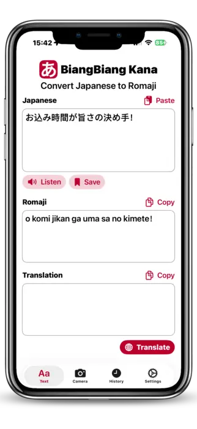
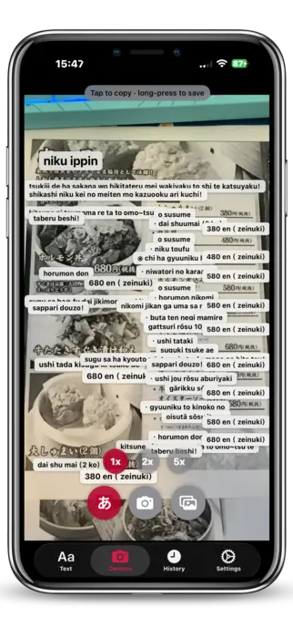

## Preamble

A few months ago I shipped [BiangBiang Hanzi](https://biangbianghanzi.app/), an iOS and Android app that points your camera at Chinese characters and gives you back the Pinyin (or Jyutping) plus a translation. The motivation back then was very practical: I'd been to China and couldn't read most of the menu at the time, even for dishes I knew how to pronounce. I was a beginner in Chinese, so I still didn't know most of the characters.

Once that pipeline existed (Vision OCR on iOS, ML Kit on Android, on-device romanization, on-device translation, a clean camera flow), I extracted everything that wasn't language-specific into a shared library, [BiangBiangUI](https://github.com/veeso/BiangBiangUI). It owns every screen, navigation, history, TTS, translation and the OCR pipeline. Each app on top of it is intentionally thin: it supplies branding, one language profile, and a transliterator. Porting to a new script became almost free, because the hard architectural decisions were already made.

Japanese was the obvious next target. It's the language I'm personally learning right now, it's notoriously hard to approach for beginners (three scripts mixed together, no spaces between words, Kanji that can be read several different ways), and a sign or a menu is completely opaque until someone reads it out loud for you. Same problem as the Chinese-menu scenario, different writing system.

So I built **BiangBiang Kana**, an iOS and Android app that points your camera at any Japanese text and reads it back in Hepburn romaji, plus a translation, in a fraction of a second. It handles Kanji, Hiragana and Katakana mixed in the same line.

The app is now available on the [App Store](https://apps.apple.com/app/id6770998277) and on [Google Play](https://play.google.com/store/apps/details?id=dev.veeso.biangbiangkana), and the source is on [GitHub](https://github.com/veeso/BiangBiang-Kana) under the Elastic V2 license.

## Read Japanese instantly

The core idea of BiangBiang Kana is simple: you should not need to read Kanji to read Japanese. The app takes any chunk of Japanese script, in any font, and gives you back three things at once:

- the original Japanese text, cleaned up;
- a Latin **romaji** transcription so you can pronounce it;
- a **translation** into the language you choose (English, Italian, French, and so on).

The romaji is the part that matters the most for learners. If you're a beginner, you usually know more spoken Japanese than you can read, so seeing `kono eki wa doko desu ka` next to この駅はどこですか unlocks the text immediately. For travelers it's even simpler: you just want to know what that sign at the station actually says, and you want it in two seconds, not after a five-minute dictionary dance.

Translation is implemented on top of Apple's on-device Translation framework on iOS (iOS 15+) and the on-device translation stack on Android, with a remote fallback for languages the device doesn't ship locally. Romaji conversion runs fully on-device.

## Point. Scan. Read.

BiangBiang Kana has three input modes, and they all end up in the same pipeline:

1. **Live camera OCR**: open the app, point it at the text, and the recognition runs in real time on the camera feed. No need to take a picture, no need to crop.
2. **Photo capture**: if the lighting is bad or the text is far away, you take a single photo and the OCR runs on the still frame.
3. **Image import**: any image from your Photos library or shared from another app (Safari, Messages, a PDF page) goes through the same OCR.

Under the hood, the iOS app feeds all three modes into Apple's Vision framework with the Japanese recognizer, and the Android app does the same with Google ML Kit's Japanese text recognition. The output is then normalised, segmented and sent to the romaji and translation stages. The whole pipeline is designed to be **fast enough to feel live**.

The UX is intentionally minimal: one screen, one button, the result on top of the camera view. No menus, no settings to tweak before you can use it. You point, you scan, you read.

## Hear how it sounds

A romaji string tells you the letters, but not the rhythm, and Japanese pronunciation is mostly about rhythm: even mora timing, pitch that doesn't match stress in any European language, long vowels that change the meaning of a word. So every recognised line can be played back through **on-device text-to-speech** with a `ja-JP` voice.

It's not a native speaker, but it's good enough to learn how a sentence is supposed to sound, it works offline, and the loop (see, read, hear) is the whole point for a learner. You spot a sign, you read the romaji, you hear it, and the next time you see those characters you actually recognise them.

## Technical challenges

Building this app sounded straightforward on paper, especially with the shared library already in place. In practice, two parts gave me the most trouble: **Japanese word segmentation** and **Kanji readings**.

### No spaces, three scripts

Japanese is written with no spaces between words, and a single sentence freely mixes Kanji, Hiragana and Katakana. A naive character-by-character transcription produces unreadable mush, because the reading of a Kanji depends on the word it belongs to, and word boundaries are not marked anywhere in the text.

BiangBiangUI's `TextProcessingEngine` owns script-span detection, passthrough and spacing, so the app only has to romanise one already-isolated Japanese span. But that span still needs real tokenisation, and the two platforms solve it differently:

| Platform | Tokenisation                                 | Reading source                           |
| :------- | :------------------------------------------- | :--------------------------------------- |
| iOS      | `CFStringTokenizer` Latin transcription      | system, resolves Kanji and Kana          |
| Android  | Kuromoji (IPADIC) morphological tokenisation | per-token Katakana reading, then Hepburn |

Keeping the two implementations in agreement, so the same sign produces the same romaji on an iPhone and on a Pixel, took more cross-checking than the OCR did.

### Kanji readings

A single Kanji can have several readings. 生 alone has more than ten depending on context (`sei`, `shō`, `nama`, `i`, `u`, `ha` and so on). Picking the right one is not a lookup, it's a disambiguation problem that needs the surrounding word, which is exactly why the tokeniser matters.

On Android, Kuromoji gives me the dictionary reading of each token in Katakana, and `KatakanaRomaji` converts that to Hepburn deterministically. On iOS, `CFStringTokenizer` resolves the reading through the system Latin transcription. Both paths still miss on rare names and on ad-hoc readings (Japanese proper names are famously unpredictable), so the app prefers the most common reading and accepts that names are the weak spot, rather than guessing and being confidently wrong.

There's also long-vowel notation. Hepburn writes long vowels with a macron (`ō`, `ū`), but OCR and tokenisers disagree on whether a given vowel is long, so a good chunk of the post-processing is just **normalising long vowels** before the text reaches the user.

## Conclusion

BiangBiang Kana started as a tool I wanted for myself, while learning Japanese, and turned out to be useful for a wider audience: learners who can speak more than they can read, travelers who just want to decode signs and menus, and anyone approaching Kanji for the first time.

If you're in any of those groups, give it a try, it's a one-tap install:

The app is also open source under the Elastic V2 license, so if you want to dig into the OCR pipeline, the romaji tables, or the shared UI library, the code is at <https://github.com/veeso/BiangBiang-Kana>. Issues, pull requests and feedback are very welcome, especially from native Japanese speakers who can spot reading mistakes I've missed.

## References

- [BiangBiang Kana on the App Store](https://apps.apple.com/app/id6770998277)
- [BiangBiang Kana on Google Play](https://play.google.com/store/apps/details?id=dev.veeso.biangbiangkana)
- [BiangBiang Kana GitHub repository](https://github.com/veeso/BiangBiang-Kana)
- [BiangBiangUI shared library](https://github.com/veeso/BiangBiangUI)
- [Apple Vision framework](https://developer.apple.com/documentation/vision)
- [Google ML Kit text recognition](https://developers.google.com/ml-kit/vision/text-recognition/v2)
