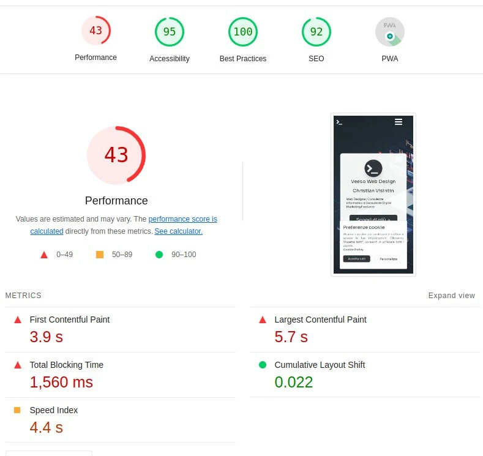

## Why to migrate your ReactJS frontend to Gatsby

Do you have a website entirely developed with React without any Server-Side rendering? And maybe you're website is mostly a static one. Well, in that case, you should really consider migrating it to Gatsby.

But what is Gatsby?

Well, if you've never heard of Gatsby, then let me introduce you to it:
Gatsby JS is a cutting-edge, open-source web development framework that leverages React and GraphQL to help developers build incredibly fast and high-performing websites and applications. What sets Gatsby apart is its ability to generate static websites that feel dynamic, providing an outstanding user experience. By pre-rendering pages and optimizing assets during build time, Gatsby ensures lightning-fast load speeds and optimal performance, enhancing SEO and boosting user engagement.

In addition to this, Gatsby has a rich set of plugins to automatize page creation and optimize your website during the build stage.

Thanks to Gatsby I've been able to integrate many cool features to my own website and to get from this



to this


This article, won't just show you how to migrate step-by-step your website from a pure ReactJS frontend to a server-side-rendered React website with Gatsby, but will also provide you with a dedicated chapter with the optimizations and things to know to boost your website performance.

## Gatsby setup

My website was quite a basic React website, I used react-router-dom to render pages based on the path and react-helmet for head metadata for SEO.

Now let's see step-by-step how to configure Gatsby in our project and migrate our website.

### Install dependencies

The first step consists obviously in installing the dependecies and removing those we don't need anymore.


First let's add the dependencies we'll need

```sh
yarn add gatsby gatsby-source-filesystem
yarn add -D gatsby-plugin-google-gtag gatsby-plugin-image gatsby-plugin-manifest gatsby-plugin-postcss gatsby-plugin-sharp gatsby-plugin-webpack-bundle-analyser-v2 gatsby-transformer-sharp
```

and at this point we can remove the now unused dependencies

```sh
yarn remove react-router-dom react-helmet parcel @types/react-router-dom @types/react-helmet
```

### Update build scripts

Since I've also removed my bundler (`parcel`) I will also need to update my build scripts to build my website with Gatsby.

```json
"scripts": {
  "develop": "gatsby develop",
  "start": "gatsby develop",
  "build": "gatsby build",
  "serve": "gatsby serve",
  "clean": "gatsby clean",
}
```

### Configure Gatsby

In order to configure Gatsby we need to create in our project root a file named `gatsby-config.ts`. This file will contain the configuration for our site and the configuration for our plugins.

```ts
import type { GatsbyConfig } from 'gatsby';

const config: GatsbyConfig = {
  siteMetadata: {
    title: `my website title`,
    description: `Default site description.`,
    author: 'veeso',
    siteUrl: `https://test.com`,
  },
  graphqlTypegen: true,
  plugins: [
    'gatsby-plugin-postcss',
    'gatsby-plugin-image',
    'gatsby-remark-images',
    'gatsby-remark-copy-linked-files',
    'gatsby-transformer-sharp',
    'gatsby-plugin-sharp',
    {
      resolve: 'gatsby-plugin-manifest', // this plugin is required to work favicons for our website
      options: {
        icon: '${__dirname}/assets/images/favicon-96x96.png',
      },
    },
    {
      resolve: 'gatsby-source-filesystem', // load files at provided path as images
      options: {
        name: 'images',
        path: '${__dirname}/src/assets/images/',
      },
    },
    {
      resolve: 'gatsby-source-filesystem', // load files at provided path as pages
      options: {
        name: 'pages',
        path: '${__dirname}/src/pages/',
      },
      __key: 'pages',
    },
    {
      resolve: `gatsby-plugin-google-gtag`, // Set GA4 tag to automatically load GA4 in your page at compile time
      options: {
        // your google analytics tracking id
        trackingIds: ['G-XXXXXXXXXX'],
        gtagConfig: {
          anonymize_ip: true,
          cookie_expires: 86400 * 7,
        },
        pluginConfig: {
          // Puts tracking script in the head instead of the body
          head: false,
        },
      },
    },
  ],
};

export default config;
```

At this point our gatsby is close to work, but we still need to create pages. Do you remember when we've removed react-router-dom? Well, that's because now we need to migrate everything under the gatsby page mechanism, but don't worry, is quiete easy to do.

### Replace react-router-dom with Gatsby

Previously I had all of my applications wrapped around a `BrowserRouter` in a component called `Router`, which did this

```tsx
return (
  <IntlProvider locale={language} messages={TRANSLATIONS[language]}>
    <SeoEngine />
    <React.Suspense fallback={<Fallback />}>
      <Topbar path={pathname} menu={routesForPath()} />
      <main>
        <Routes>
          <Route index path="/" element={<Home />} />
          <Route path="/about-me" element={<About />} />
          <Route path="/contacts" element={<Contacts />} />
          <Route path="/cookie-policy" element={<CookiePolicy />} />
          <Route path="/privacy" element={<Privacy />} />
          <Route path="/products" element={<Products />} />
          <Route path="/products/:product" element={<ProductPage />} />
          <Route path="/quote/:product" element={<Quote />} />
          <Route path="/thank-you" element={<ThankYou />} />
          {/* catch all */}
          <Route path="/*" element={<NotFound />} />
        </Routes>
      </main>
      <Footer />
      {cookieBar}
    </React.Suspense>
  </IntlProvider>
);
```

As you can see my router didn't just route the page components based on the path, but also it wrapped the page content around the Topbar and the Footer and the Cookie bar as well (while SEOEngine is the component which does the react-helmet stuff).

In this migration, starting from my router we have three things to do:

1. migrate the "wrapper" to a component.
2. move page components to pages.
3. move templated page components (e.g. /quote/:product) to templates.

#### Migrate the Page Wrapper to a component

That's the easy part. We can just implement a brand new component called `PageWrapper` that we'll be including in each page.

```tsx
import * as React from 'react';
import { IntlProvider } from 'react-intl';

import TRANSLATIONS, { getNavigatorLanguage } from '../utils/locale';

import CookieBar from './CookieBar';
import { routesForPath } from '../utils/routes';
import Topbar from './Topbar';
import Footer from './Footer';

import '../../styles.css';

interface Props {
  pathname: string;
  children: React.ReactNode;
}

const PageWrapper = (props: Props) => {
  const language = getNavigatorLanguage();

  React.useEffect(() => {
    window.scrollTo(0, 0);
  }, [props.pathname]);

  return (
    <IntlProvider locale={language} messages={TRANSLATIONS[language]}>
      <Topbar path={props.pathname} menu={routesForPath()} />
      <CookieBar />
      <main>{props.children}</main>
      <Footer />
    </IntlProvider>
  );
};

export default PageWrapper;
```

If you need to **import css or you use tailwind**, do it here with the import directive.


#### Move Page components to Pages

All of the pages we need to serve on our Gatsby website, need to be declared inside of `src/pages`.
We'll need to do this for each of our pages, so starting from my `/` route which was called I will create a file `src/pages/index.tsx`.

> ‼️ `index.tsx` will always resolve to `/`, while `404.tsx` to the NotFound page, while for instance `about-me.tsx` will resolve to `/about-me`.
> If you need sub paths, like `/home/about-me` you will need to create the page at `src/pages/home/about-me.tsx`.

In our `Index` component we'll put the same thing we had there before, but wrapping everything inside of our `PageWrapper` component.

```jsx
import * as React from 'react';
import { PageProps } from 'gatsby';

const Home: React.FC<PageProps> = ({ location, data }) => {

  return (
    <PageWrapper pathname={location.pathname}>
      <Page.BlankPage className="about">
        <Hero>
          <Card />
        </Hero>
        <Container.PageContent>
          <Resume />
          <Jobs />
          <Activities />
          <ContactMe />
        </Container.PageContent>
      </Page.BlankPage>
    </PageWrapper>
  );
};
```

So it's quiete simple as you can see. Now you must do it for every other page you have on your website.


#### Move Templated Page components to Templates

In the router I showed you previously, you can see that I have these two routes:

```tsx
<Route path="/products/:product" element={<ProductPage />} />
<Route path="/quote/:product" element={<Quote />} />
```

Basically these two routes render different information based on the `product` slug.
In this case we won't be able to use a component in `pages` for our purpose, but we need to create some **templates** for these two routes.

The first thing we need to do is to create a new directory `src/templates` and then here, we create our templates, for example for my ProductPage, I will create a file named `src/templates/product.tsx`:

```tsx
import * as React from 'react';
import { PageProps } from 'gatsby';

const ProductTemplate: React.FC<PageProps> = ({ pageContext, location }) => {
  const { product } = pageContext;

  const slug = product as QuoteSlug;
  const productConfig = PRODUCTS_PAGE_CONFIGURATION[slug];

  return (
    <PageWrapper pathname={location.pathname}>
      <Page.BrandPage>
        <Card className="m-auto w-8/12 sm:w-11/12">
          <Product showDiscoverButton={true} {...productConfig} />
        </Card>
      </Page.BrandPage>
    </PageWrapper>
  );
};
```

If you give a closer look, I pass the product slug in the `PageProps` in `pageContext`, unfortunately, this thing is not automatic, instead we need to configure Gatsby to do so.

To implement this we need to create a new file in our project root called `gatsby-node.ts`. This file can contain different directives to configure Gatsby in the generation of your pages.

In our case we'll need to configure it to create our templated pages for our products.

```ts
import { CreatePagesArgs } from 'gatsby';
import path from 'path';

import { QuoteSlug } from './src/js/data/quote';

exports.createPages = async ({ actions }: CreatePagesArgs) => {
  const { createPage } = actions;

  // create quote pages
  const products = [
    QuoteSlug.CHATBOT,
    QuoteSlug.DIGITAL_MARKETING,
    QuoteSlug.ECOMMERCE,
    QuoteSlug.WEB3,
    QuoteSlug.WEBAPP,
    QuoteSlug.WEBSITE,
  ];

  products.forEach((product) => {
    createPage({
      path: `/quote/${product}`,
      component: path.resolve('./src/templates/quote.tsx'),
      context: {
        product,
      },
    });
  });

  // create product pages
  products.forEach((product) => {
    createPage({
      path: `/products/${product}`,
      component: path.resolve('./src/templates/product.tsx'),
      context: {
        product,
      },
    });
  });
};
```

So basically here we are overriding the `createPages` Gatsby function, which we'll be executed to create our custom pages.
We provide an array containing all the products we have, and then we create the templated page for each of them.

Note that we put the `product` variable inside of `context`. That will make the `product` slug available in the `PageProps` as we've already seen before.

> ‼️ This directive can be used for many purpose, for example we could also use it to create some blog posts starting from some markdown files (as I do on this website, for instance).

#### Extra: remove react-router-dom Link and hooks

In my case my website also had some `Link` components and `useNavigate` hooks to change the current page to display.

Luckily this migration is extremely easy to do:

The React-Router-dom `Link` and `useNavigate` can be immediately replaced by the components provided by Gatsby:

```tsx
import { Link, navigate } from 'gatsby';
```

While `useLocation` can be replaced by using the `location` in the `PageProps` when rendering a Page. You can actually also use `import { useLocation } from '@reach/router';`

At this point your site should already been working, if you run `yarn start`.


But there are still many things we can do to improve it.

### Migrate from react-helmet to Gatsby

This point is not super essential actually, indeed probably your site is already working as-is, but it makes you able to get rid of react-helmet, which means smaller bundle size.


Basically what we can do is just override the `Head` having some properties from Gatsby for our page directly with Gatsby. To do that I'm going to first rewrite my `SeoEngine` component:

```tsx
const SeoEngine: React.FC<React.PropsWithChildren<Props>> = ({
  description: propDescription,
  lang: propLang,
  title: propTitle,
  image,
  article,
  canonicalUrl: propCanonicalPath,
  nonCanonical = false,
  author: propAuthor,
  noindex = false,
  children,
}) => {
  const { pathname } = useLocation();

  const { siteUrl, author: metadataAuthor } = useSiteMetadata();

  const title = propTitle || pageTitle(pathname);
  const description = propDescription || pageDescription(pathname);
  const ogSiteName = pageOgSiteName(pathname);
  const defaultCanonicalPath = `${siteUrl}${pathname}`;
  const canonicalUrl = propCanonicalPath || defaultCanonicalPath;
  const lang = propLang || getNavigatorLanguage();
  const author = (propAuthor || metadataAuthor) ?? '';

  if (isPageNotFound(pathname)) {
    return (
      <>
        <title>{title}</title>
      </>
    );
  } else {
    return (
      <>
        <html lang={lang} />
        <title>{title}</title>
        {!nonCanonical && <link rel="canonical" href={canonicalUrl} />}
        <meta name="description" content={description} />
        <meta property="og:title" content={title} />
        <meta property="og:description" content={description} />
        <meta property="og:type" content={article ? 'article' : 'website'} />
        <meta property="og:url" content={canonicalUrl} />
        <meta property="og:site_name" content={ogSiteName} />
        <meta property="og:locale" content={lang} />
        <meta name="twitter:creator" content={author} />
        <meta name="twitter:site" content={author} />
        <meta name="tiwtter:url" content={canonicalUrl} />
        <meta name="twitter:title" content={title} />
        <meta name="twitter:description" content={description} />
        {image ? (
          <>
            <meta property="og:image" content={`${siteUrl}${image}`} />
            <meta name="twitter:card" content="summary_large_image" />
          </>
        ) : (
          <>
            <meta property="og:image" content={`${siteUrl}/og_preview.png`} />
            <meta name="twitter:card" content="summary" />
            <meta property="og:image:width" content="1200" />
            <meta property="og:image:width" content="630" />
          </>
        )}
        {noindex && <meta name="googlebot" content="noindex, nofollow" />}
        {children}
      </>
    );
  }
};
```

This is a quiete good standard head component to pair with Gatsby.
But now, we need to integrate it in our pages.

First of all we need to remove it from `PageWrapper` and then for each page we need to do this:

```tsx
import { HeadFC, PageProps } from 'gatsby';

const Consulting: React.FC<PageProps> = ({ location }) => (
  ...
);

export const Head: HeadFC = () => <SeoEngine />;
```

> ‼️ In `Head` you can actually do a lot of stuff, [checkout the documentation](https://www.gatsbyjs.com/docs/reference/built-in-components/gatsby-head/).

At this point we have also removed react-helmet and our bundle should start to weight a lot less than the original one, but let's see how we could improve our site.

### Optimize images

Currently our images are still 'img' components with a URL as src. We can make Gatsby optimize our images to compress them and add the `width` and `height` attributes which are good for our website performance.

To do so is enough to replace our `img` components with `StaticImage`:

```tsx
<StaticImage
  loading="eager" // "eager" if above-the-fold or "lazy" otherwise
  className="..."
  src={'../../../../assets/images/logo.webp'} // relative path to source
  alt="picture"
/>
```

In case our image is not "static", but comes from a query or a prop, we can use `GatsbyImage`, but this requires a GraphQL internal query, which is not always possible. In that case you'll still have to rely on the classic `img`. See the [Gatsby image API](https://www.gatsbyjs.com/docs/reference/built-in-components/gatsby-image/).

### Beware of window

In your code you may have functions which use `document` or `window`, such as functions to push GA4 events, or to retrieve the navigator language.

In this case, you always need to check whether `window` is defined at the beginning of the function body and return a default value. That's necessary because Gatsby will execute the script of all these files to render the pages at build-time and since it's not a browser, window will be undefined.

For that reason, it's enough to add this line in your functions that use `window` or `document`

```ts
if (typeof window === 'undefined') return SOMETHING;
```

## Tips and tricks

I've written this chapter to integrate some tips and tricks I've found out while developing in Gatsby. Probably I will update this chapter during the next months or years.

### The Cookie Bar hydrate issue

My website, as many others, has a cookie bar which is rendered whenever the current user doesn't have the policy-cookie set.

In this case on my previous pure React website I did something like:

```tsx
const CookieBar = () => {
  const [hasCookieBar, setHasCookieBar] = React.useState(!hasCookiePreferences());

  ...

  return hasCookieBar ? <MyCookieBar>...</MyCookieBar> : null;

};
```

Unfortunately this has to be changed, and **carefully** in Gatsby.
In my case this caused that when the cookie bar was mounted, the page images were reloaded, even if not covered by the cookie bar. But why?

I struggled a lot with this issue, but basically the reason is that Gatsby puts in your client script some mechanism to detect whether the rendered page is different from the one expected by the server. In this case it forces a page reload.

This means **VERY POOR** performance.

So how to deal with it?

Instead of making the render of the cookie bar optional, just hide it when `hasCookieBar` is `false`.

```tsx
return (
  <Container.Container
    className={`${
      hasCookieBar ? 'animate__animated animate__slideInUp' : 'hidden'
    } fixed z-50 right-0 left-0 w-full bottom-4`}
  >
    ...
  </Container.Container>
);
```

Is that easy? More less, but we can still do better.
After implementing that indeed, I still had 5 seconds for Largest Content Paint. Which is **awful**. The reason was that before rendering the cookie bar, it was necessary to check the cookie, but this happened after all the scripts were loaded and compiled by the browser, which takes a while of course. How to fix this, then?


It took me a while to figure out, but the solution is actually quiete simple.

Let's load the cookie on component mount I thought.

```tsx
const CookieBar = () => {
  const [hasCookieBar, setHasCookieBar] = React.useState(false);
  ...

  React.useEffect(() => {
    initGaConsent(false, isAnalyticsCookiesConsentGiven());
    setHasCookieBar(!hasCookiePreferences());
  }, []);

```

It should work, right?
**Unfortunately it still doesn't**. This still will increase your LCP time. But the final solution is very tricky, but stupid: **Just use a Timeout**, instead.

```tsx
React.useEffect(() => {
  initGaConsent(false, isAnalyticsCookiesConsentGiven());
  setTimeout(() => {
    setHasCookieBar(!hasCookiePreferences());
  }, 1000);
}, []);
```

This will fix it, once for all.


### NGINX Cache directives

This is just a note, that in case you're serving your Gatsby page behind a NGINX server, you need to remove the cache directives from your server configuration, otherwise it won't work for some reason.

### Extra: Replace gatsby-plugin-google-gtag with Partytown

Ever heard of Partytown?

> Partytown is a lazy-loaded library to help relocate resource intensive scripts into a web worker, and off of the main thread. Its goal is to help speed up sites by dedicating the main thread to your code, and offloading third-party scripts to a web worker.

Partytown can help us to speed up our page. In this example I'll show you how to just implement it for GA4, but in can be applied to any external javascript library. And trust me, the performance will improve significantly, even if just for analytics.

First of all we need to remove the gtag plugin. **So soon**.

First remove this from `gatsby-config.ts`

```ts
{
      resolve: `gatsby-plugin-google-gtag`,
      options: {
        // your google analytics tracking id
        trackingIds: ['G-P1G1JW9N1R'],
        gtagConfig: {
          anonymize_ip: true,
          cookie_expires: 86400 * 7,
        },
        pluginConfig: {
          // Puts tracking script in the head instead of the body
          head: false,
        },
      },
    },
```

Then let's uninstall it from our dependencies and install partytown:

```sh
yarn remove gatsby-plugin-google-gtag
yarn add @builder.io/partytown
```

Now we can configure partytown, but first add this directory to your gitignore: `static/~partytown`

Then go to `gatsby-node.ts`, and add this:

```ts
import { copyLibFiles } from '@builder.io/partytown/utils';

exports.onPreBuild = async () => {
  await copyLibFiles(path.join(__dirname, 'static', '~partytown'));
};
```

Finally, we need to define the behaviour of Partytown in the SSR configuration. Create if not exists, the file `gatsby-ssr.tsx` and put this into it:

```tsx
import React from 'react';
import { Partytown } from '@builder.io/partytown/react';

const ORIGIN = 'https://www.googletagmanager.com';
const GATSBY_GA_MEASUREMENT_ID = 'G-XXXXXXXXX';

export const onRenderBody = ({ setHeadComponents }) => {
  if (process.env.NODE_ENV !== 'production' && process.env.NODE_ENV !== 'test')
    return null;

  setHeadComponents([
    <Partytown key="partytown" forward={['gtag']} />,
    <script
      key="google-analytics"
      type="text/partytown"
      src={`${ORIGIN}/gtag/js?id=${GATSBY_GA_MEASUREMENT_ID}`}
    />,
    <script
      key="google-analytics-config"
      type="text/partytown"
      dangerouslySetInnerHTML={{
        __html: `window.dataLayer = window.dataLayer || [];
        window.gtag = function gtag(){ window.dataLayer.push(arguments);}
        gtag('js', new Date()); 
        gtag('config', '${GATSBY_GA_MEASUREMENT_ID}', { send_page_view: false })`,
      }}
    />,
  ]);
};
```

And there you go. Partytown should serve your google analytics script on a separate worker and your lighthouse score should have increased a lot.

## Where to go from now

Congratulations, your website is now way more efficient thanks to Gatsby.

Gatsby is a huge environment and the learning curve is really high, so take your time and take a look at the official Gatsby documentation to see the opportunities you have with it.
For example, after the migration, I decided to crawl from my blog's RSS feed the latest posts, so I can now show them on my website home page.
But, there's really a lot you can do from here.
Enjoy Gatsby and your new rank on Google thanks to this migration.


Thanks for your time in reading my blog post, please consider to support me by sharing this article and if you have time also give a look to the other posts.
