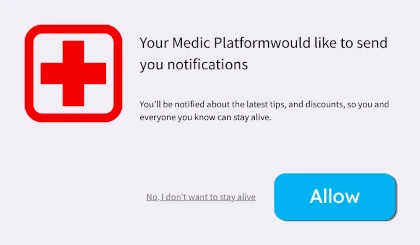
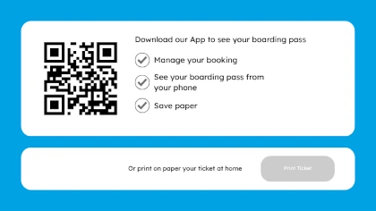

## The boarding pass should be boring

Today I checked in for a flight to Amsterdam, and immediately noticed there was no option to add the ticket to my Apple Wallet.
On the contrary, the website only offered me the option to download their app to have the ticket on my iPhone or to print the ticket on paper.

I was like, really? In 2026, will I still have to download your app or print on paper?

Both Google and Apple wallet tickets are extremely simple after all, just a QR showing simple information. Where is the complexity?

## The obvious excuse: technical complexity

Give them some credit. Most airlines run on legacy systems that may lack the software to support Apple or Google wallets.
Indeed, some of these websites look extremely old. This airline’s website itself still has the same interface as ten years ago, and the Italian translation is incredible; like using the courtesy form, which nobody in Italy has ever used since the Middle Ages.

Sorry, not sorry to say, though, that’s just an excuse. Indeed, some airlines have stopped offering Apple Wallet and Google Wallet tickets. I’m 100% sure that one year ago, I took a flight to Rome with ITA Airways and had the tickets in Google Wallet, but 14 months later, when flying with them again, I had to install their app.

How can this be possible? Is maintaining support for smartphone wallets a hard and expensive task? Not at all, it’s just marketing.

## Keeping you inside the app

One thing that nobody tells you is that they just want to keep you inside their app.

Indeed, if they just provided you with the ticket, they would lose several opportunities: both to sell you extras for your flight and to keep you as a future customer.

Have you ever noticed how many notifications airlines’ apps send you in a month? Well, I have muted them all, but a couple of years ago I didn’t, and I remember a weekly notification proposing a weekend in some random city in Lithuania.

And of course, whenever you access your ticket, they don’t waste the opportunity to sell you onboard snacks, magazines, lounge, fast-track and why not, maybe perfumes.

Now you can easily get what the interest is in keeping you on their platform rather than just giving you the ticket. If you’re wondering whether this pattern works, let me be clear: it works great, especially thanks to the usage of **dark patterns**.

## What are dark patterns

Dark patterns, also known as deceptive patterns, are small design decisions that quietly shift control from the user to the business: hiding the convenient option, adding friction to the honest one, or making the profitable path feel like the default.

### Making you feel guilty

In particular, for airlines, the most widely adopted pattern is known as **confirmshaming**.

From _[deceptive.design](https://deceptive.design)_, the definition of confirmshaming is:

> The user is emotionally manipulated into doing something that they would not otherwise have done.

You have probably already seen layouts such as this one:

Well, that shows very clearly what confirmshaming is. Accept our notifications that we can use to bomb you with ads, and be ashamed of your life choices.

That may be brutal, but this is not much different from making you choose between downloading the airline’s app or wasting paper, as this airline, and many others, do, with these layouts:

Exactly, trying to have you make a choice, not be ashamed of wasting paper. But you shouldn’t feel ashamed at all. The solution for preserving paper exists, and it’s called Apple Wallet or Google Wallet. I proudly affirm that I printed this ticket; I didn’t download the app.

## Conclusion - The Low-cost irony

I haven’t mentioned the airline behind this story yet.

If you think it was a low-cost airline, which is an everyday victim of shitstorms from all over the internet, you’re wrong.
This is a national carrier, KLM in particular.

And I can tell you more: Ryanair has had tickets on Apple Wallet and Google Wallet for many years, and we all know how many things they try to sell you on their website. But apparently, they care about their customers more than many national carriers you pay 3 or 4 times as much for.

Reference:

- Brignull, H, Leiser, M, Santos, C & Doshi, K, 'Deceptive Design' (2023) <https://www.deceptive.design/> accessed 25 April 2023
- <https://neal.fun/dark-patterns/>: An interactive page showing the most common dark patterns used by companies on their website.
