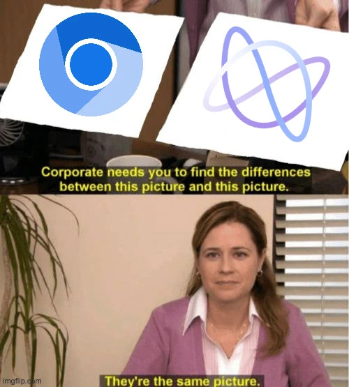

## What happened

On June 5th 2026, [Ladybird](https://ladybird.org/) made this announcement on social and on their website:

> Ladybird is moving into a new phase as we work toward our first alpha release.
> We are tightening how code enters the project: going forward, code changes will only be introduced by project maintainers, and we will no longer accept public pull requests.

Full post: <https://ladybird.org/posts/changing-how-we-develop-ladybird/>

## What is Ladybird

For those who don't know what Ladybird is, it is not just a random project. It is, as they claim, a *truly independent web browser*. In a couple of years, they have developed a browser engine from scratch, becoming the *third way* in the browser ecosystem. The browser ecosystem has left many concerned in recent years because of the monopoly created by Chromium, with just a little slice of the market left to Firefox. Let's clarify, it's not about browsers, it's about browser engines. There are many alternatives to Chrome, but just a couple to Chromium.

## The reason behind this decision

Ladybird claims the decision is a security and responsibility issue, accelerated by AI-generated contributions. They, like many other projects, are facing a world where AI can generate convincing-looking patches at almost no cost, making it harder to infer trust, effort, and responsibility from a pull request.

## Still open-source?

As the article clearly states, they claim to be still open-source:

> Ladybird remains open source. The source code will continue to be publicly available under an open source license. Outside involvement still matters: clear bug reports, reductions, website testing, standards discussion, design discussion, security reports, and technical feedback all help move the project forward.

I have strong concerns about this. There is a clear legal and licensing definition of open-source software, but there is a **less clear cultural expectation** around what an open-source project should allow its community to do.

Is it enough to have the source available? Not really, in that case we talk about *source-available*, which doesn't imply open-source. For instance, the Elastic V2 license, which forbids others from commercialising your software, is considered source-available, but not open-source.

Is it then just about the license? Nay. While it is true that the license grants users the rights to use, fork, create their own implementations, and build a totally new product from it, it doesn't actually address direct contributions to the original project.

Ladybird is preventing users from contributing to their software. Ladybird is still open source in the licensing sense, but it is **no longer open to upstream code contribution from the public**. That matters because for many developers, open source is not only about legal rights; it is also about the possibility of participating in the project's direction.

While it is true that anyone can fork the project to apply changes, those changes will never reach most users.

### Fork is not enough

Claiming that as long as people can fork and make their own changes, it's enough to keep the project open-source is a bit weak.

Contributing is not about applying changes on your machine that nobody else will see: **that's an edit, not a contribution**. And open-source is also about contributing.

Nobody cares about forks most of the time because they are sparse, and unless the main project is, like, discontinued, they are statistically unlikely to get people involved.

A good example of a successful fork is [ratatui](https://ratatui.rs/), but the original `tui-rs` was also discontinued. Also, the complexity of maintaining Ratatui, not to offend, can't be compared to that of maintaining a project like Ladybird.

You can easily see that there will never be a chance for the community to create a strong fork of Ladybird unless a company decides to invest serious engineering resources in it.

### Forks are not resistance

Forking gives users a legal escape hatch, but public pull requests give the community a visible place to resist the project's direction.

If an unpopular feature lands upstream, sure, someone can fork the project and remove it. But in practice, most users will continue to follow the main project. The fork will have no brand, no distribution, no update pipeline, and probably no team.

A public contribution process is not only about adding code. It is also about contesting code, proposing reverts, and forcing a public discussion around technical decisions. Without that, the community can still talk, but it has much less leverage where it actually matters: upstream.

## Was closing public PRs the only option?

In the past year, many projects have been significantly affected by large numbers of AI-authored PRs, with varying outcomes. For instance, cURL ended its bug bounty program after an unsustainable wave of low-quality security reports, many of them AI-generated or AI-assisted. ~~(and maybe also because agents would have made the bounty model economically unsustainable)~~.

Ladybird is not an exception; BUT was this the only viable solution?

In my opinion, absolutely not: there are plenty of mechanisms to prevent AI slop PRs from getting out of control.

There are plenty of bots to filter and moderate PR content; there could be a system to filter by trusted developers. We have `AI_POLICY.md`, which can be used to immediately close PRs by requiring contributors to state and explain any AI code.

> But these systems are expensive

They're not free, but Ladybird has plenty of big sponsors that backed the project.

Based on Ladybird’s [public sponsorship tiers](https://ladybird.org/#sponsors), sponsorships run for one year and range from Copper at $1,000 to Platinum at $100,000. Based on the sponsors currently listed on their website, the project appears to have received at least $500,000 in annual sponsorships.

I am not here to create conspiracy theories, and I am not saying AI had nothing to do with this. AI slop is real. But I doubt it is the whole story.

Could this decision instead reflect a broader shift in what is expected of funded open-source infrastructure? A shift away from the commons, **where outsiders can become insiders** through contribution, and towards professionally governed products with publicly available source code.

## Conclusion

This meme is a provocation, of course. But behind the joke lies an uncomfortable question: are we really capable of building a truly independent web browser?
