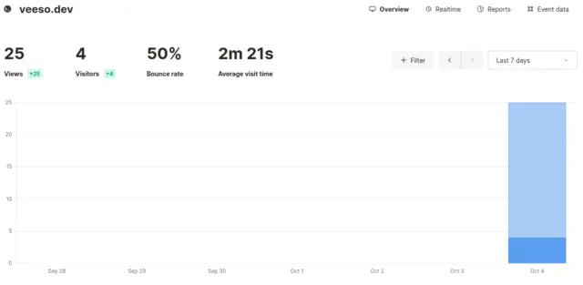
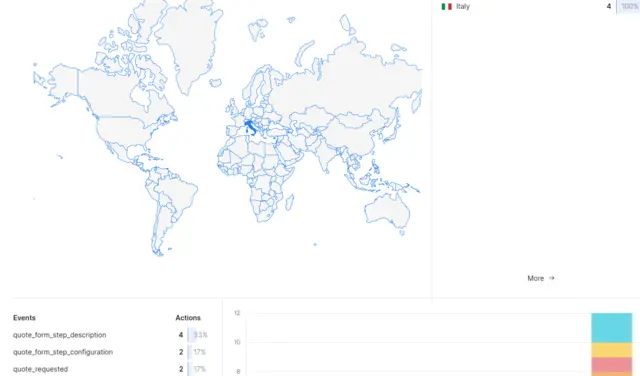

## Google Analytics is mostly overrated

I've used GA4 for my website in the past few months since it was released at the beginning of 2023, but to be honest, I couldn't really enjoy it, and I actually found several pain points in its usage:

### Poor user experience

I must admit, I'm not a huge fan of Google dashboards. I am both an **Analytics** and **Google ADS** user, and both of these products have, in my opinion, a very poor design in terms of user experience.

The **dashboard** isn't particularly **intuitive** in usage, and event parameters aren't shown unless in reports, which is really annoying to have an overview of what the users are sending.

And I didn't mention the fact that as soon as you open any tab, you start creating nesting accordions that will cover your entire screen.

And what about performance? The GA UI is **extremely slow**.

I have no doubt that for huge websites that require a lot of data analysis, Google Analytics has more to offer, but is this also true for **the average website**? I think not, to be honest.

### And then there's GDPR


Cookies are a painful topic. Whenever I design a website, I have to check for every cookie we use and add a paragraph to the privacy and cookie policy about it. And of course, whenever we use cookies, we require a cookie bar, which is never a simple task to achieve. In [my previous article](https://blog.veeso.dev/blog/en/how-to-migrate-from-reactjs-to-gatsby/), I talked about how rendering the cookie bar in Gatsby gave me some issues with the performance, so I also wanted to get rid of it, but guess what? I couldn't, because Google Analytics requires a cookie policy.

But why, you may guess? Why is an analytics cookie necessary for Google Analytics? Well, **we don't need to track user-sensitive information to analyze the traffic on our website**. But Google does. Why? Because Google uses this data to profile users, in order to provide them with advertisements they may be interested in.

Indeed, **Google Analytics is not free**, they provide you with the service, but they want your users' data in exchange.

But **we've got to break free** and say goodbye to GA once for all!


There are actually several alternatives we can choose from, but I decided to opt for [Umami](https://umami.is).

## Umami is the best solution out there

[Umami](https://umami.is/) is a simple Web Analytics tool.
It provides a **script** which must be included on your website to track events and page view and a web interface where you can configure all the domain you want to collect data from. The user interface is very easy to use and quite simple. Oh, and it's very fast and performant.
The user interface also allows to configure different users which can have access to different properties.

Currently Umami is both **free if you self-host** on your VPS or you can opt for payware a **SaaS solution**, which is quite **cheap**. Personally since I use VPSs I always opt for the self-hosted solution.

The dashboard shows an overview of the traffic on the website we're tracking



then we can monitor the different pages visited and the client agents:


and finally we have an overview of the events tracked and the origin of our users. For each event we can then have details with all the parameters associated:



## How to migrate from Google Analytics to Umami

Migrating from Google Analytics to Umami is a very simple task and it takes about 30 minutes to do so.
In this tutorial I'll show you how to configure Umami for with the self-hosted solution, but _you can skip the first chapter if you opt for the SaaS solution_.

### Configure Umami on your VPS

First of all you need to install `docker` and `docker-compose` on your VPS.

Then, in your app directory, you need to get umami: `git clone https://github.com/umami-software/umami.git` and inside of it, checkout for the latest release with `git checkout v2.7.0`.

Now, change the secret key for umami `vi docker-compose.yml`:

```yml
version: '3'
services:
  umami:
    image: ghcr.io/umami-software/umami:postgresql-latest
    ports:
      - '3000:3000'
    environment:
      DATABASE_URL: postgresql://umami:umami@db:5432/umami
      DATABASE_TYPE: postgresql
      APP_SECRET: CHANGE THIS VALUE
```

Finally you may want to serve the umami web interface on a web server with `docker-compose up -d`.

Now, if you want to serve the web interface on an address reachable by the internet, you'll need to use a reverse proxy. I use NGINX for my web server, so you can now configure your server as this one:

```conf
server {
  server_name mydomain;

  location ~ /.well-known {
    allow all;
    root /var/www/html;
  }


  location / {
    proxy_pass http://localhost:3000;
    proxy_set_header X-Real-IP $remote_addr;
    proxy_set_header Host $host;
    proxy_set_header X-Forwarded-For $proxy_add_x_forwarded_for;
  }

  listen 443 ssl; # managed by Certbot
  ssl_certificate /...; # managed by Certbot
  ssl_certificate_key /...; # managed by Certbot
  include /etc/letsencrypt/options-ssl-nginx.conf; # managed by Certbot
  ssl_dhparam /...; # managed by Certbot

}

server {
  if ($host = mydomain) {
    return 301 https://$host$request_uri;
  } # managed by Certbot


  server_name mydomain;
  listen 80;
  return 404; # managed by Certbot

}
```

At this point you can setup umami by accessing to the public url and following the [official documentation](https://umami.is/docs/login).

### Use Umami on your frontend

For this tutorial, I'm using as usual my website, which is developed with GatsbyJS.
First of all, we need to install the umami gatsby plugin with `yarn add gatsby-plugin-umami` and add it to the `gatsby-config.ts` file:

```ts
{
  resolve: `gatsby-plugin-umami`,
  options: {
    websiteId: 'YOUR_WEBSITE_ID',
    srcUrl: 'https://mydomain/script.js',
    includeInDevelopment: false,
    autoTrack: true,
    respectDoNotTrack: false,
  },
},
```

In this example I'm not going to use **partytown**, since I haven't been able to use it, due to some issues with CORS, so I dropped the partytown support on my website. Don't worry though, the performance impact of umami is very slow, so partytown is quite unneccessary.

If you use TypeScript and you also need to send events from script, we also need the `window.umami` declaration. So we need to install the types: `yarn add -D @types/umami-browser`.

At this point we can get rid off of our cookie bar, if you just used GA and replace your event push function with this one:

```ts
const pushAnalyticsEvent = (eventName: string, parameters: any) => {
  if (typeof window === 'undefined') {
    return;
  }

  const canUseUmami = window.umami !== undefined;

  if (canUseUmami) {
    try {
      window.umami.track(eventName, parameters);
    } catch (e) {
      console.error(`failed to track ${eventName}: ${e}`);
    }
  }
};
```

And now you should be able to see the events tracked on Umami.


## Extra: An alternative to keep in mind (for the future) - Cloudflare Analytics

The other day, a friend of mine told me of the existance of [Cloudflare Website Analytics](https://www.cloudflare.com/web-analytics/), which is a GDPR compliant _alternative_ to Google Analytics, which is basically free and doesn't require any cookie bar.
I gave it a look and it's nice, but unfortunately it doesn't look like it supports custom events sent from javascript, so it could be a good solution in case you don't need custom events.

I will surely check if they add this possibility in the future though.

## Conclusions

If you ask me, I'm really happy with this migration. I think my website will benefit a lot from this and I think everyone who doesn't need any specific feature related to GA, should do the same, not only because it actually works better than GA, but also because your users would probably be happier if you stop selling their data to Google.


