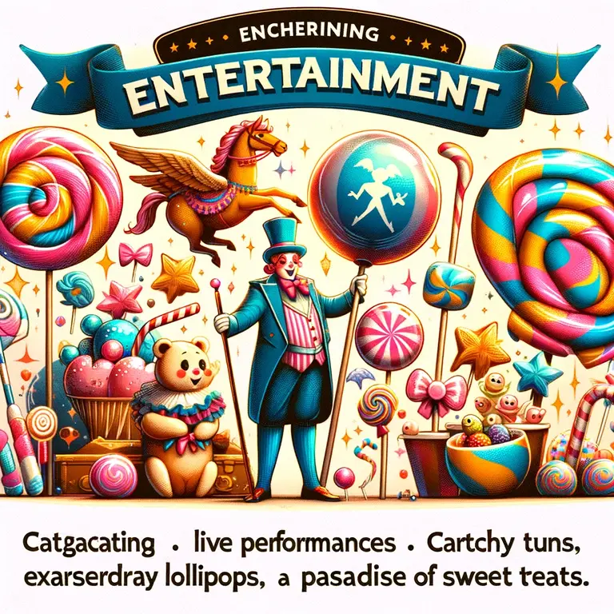

## Un breve riassunto di come l'IA ha preso il sopravvento

Se tornassimo a cinque anni fa e avessi detto "IA" davanti a qualcuno, probabilmente il primo pensiero che sarebbe venuto in mente sarebbe stato la fantascienza, NPC stupidi nei videogiochi o una serie di video ridicoli di robot testati in Giappone che fanno cose strane in TV.

Ma dal lancio di ChatGPT nel 2022, le cose sono cambiate molto.
All'improvviso tutti hanno iniziato a parlare di IA, tutti su Twitter hanno cominciato a vendere corsi per diventare professionisti dell'IA e tutte le persone nel mondo hanno iniziato a parlare della minaccia di perdere il lavoro a causa dell'IA.

Dopo quasi due anni, non posso negare che ChatGPT e tutti i prodotti simili abbiano avuto un ruolo importante nelle nostre vite. Come sviluppatore ho praticamente smesso di usare Stack Overflow a favore di ChatGPT, e molte altre persone hanno iniziato a usare l'IA per diversi scopi in tutto il mondo.

Anche se non sai nulla di IA e non hai mai usato ChatGPT prima, sicuramente hai incontrato i suoi prodotti. Basta iniziare a guardare video su TikTok per trovare molti video che utilizzano l'IA per la voce o per la grafica, e ora anche per il video stesso.

Non nego che **l'IA sia fantastica**. Abbiamo risposte a problemi complessi in pochi secondi, mentre prima dovevamo navigare per ore nei forum per trovare forse una soluzione.

Abbiamo la possibilità di creare loghi e illustrazioni, mentre prima dovevamo pagare per ogni dannata immagine di stock.

Abbiamo la possibilità di avere una voce narrante per i video, mentre prima avevamo bisogno di un doppiatore.

**Ma a quale costo?** E quali sono, a mio parere, i peggiori prodotti che abbiamo implementato con l'uso dell'IA?

## La Willy's Chocolate Experience

La pubblicità ha iniziato a fare un uso massiccio dell'IA, a volte con i peggiori risultati.

Ricordiamo ancora il terribile evento della [Willy's Chocolate Experience](https://en.wikipedia.org/wiki/Willy's_Chocolate_Experience), dove è stato fatto un uso massiccio dell'IA per creare la sceneggiatura dello spettacolo, che era assolutamente spazzatura, e l'intera pubblicità per lo spettacolo, che ha reso possibile trasformare questo

in questo

E so che qualcosa può letteralmente essere pubblicizzato male e in modo truffaldino anche senza IA, ma ora tutto questo permette di farlo senza sforzo alcuno.

## Wish

E questo utilizzo dell'IA sta forse colpendo anche altri settori.

Il recente rilascio di "**Wish**" della **Disney** ha suscitato conversazioni non solo per la sua trama, ma anche per le sue canzoni apparentemente non ispirate. Molti speculano che la banalità della colonna sonora possa essere attribuita al coinvolgimento dell'IA nel processo di scrittura delle canzoni, una mossa potenzialmente dettata dallo **sciopero degli sceneggiatori a Hollywood**. Lo sciopero ha lasciato un vuoto significativo nel talento creativo, portando gli studi a fare affidamento sull'intelligenza artificiale per colmare il divario.

**Chiaramente non ci sono prove che la Disney abbia veramente usato l'AI**, ma l'intero film sembra davvero troppo semplice per gli standard Disney. Potrebbe essere che l'AI sia stata coinvolta nella sua creazione?

## L'inferno del blogging

Se leggi un articolo di un blog nel 2024, è molto probabile che non sia stato scritto a mano. Questo è particolarmente vero per alcuni tipi di blog, in particolare quelli focalizzati sull'indicizzazione su Google. Non il mio, nessuno legge il mio blog.

Ma chiunque possieda un'agenzia di viaggi, un negozio di animali, un'agenzia di marketing ora ha un blog, e il 99% delle volte gli articoli dei blog sono scritti dall'IA. Questo perché a loro non importa davvero scrivere un blog, ma è solo legato al fatto che Google posiziona il tuo sito più in alto nei risultati di ricerca in base al traffico che generi. Quindi, se il tuo blog genera molto traffico con parole chiave, il tuo sito web riceve traffico. Ma scrivere articoli è una fatica, quindi lascia che ChatGPT lo faccia per te.

## GPT-vetting e Recruiting

E il gran finale **GPT-Vetting**!

Penso che questo [tweet](https://twitter.com/aliniikk/status/1778796486194823514) sia autoesplicativo.

Stiamo davvero arrivando al punto in cui le aziende non vogliono dare tempo per trovare un candidato per una posizione?

Se ti capita mai di incontrare un'azienda che utilizza questi strumenti, ti consiglio vivamente di non partecipare all'intervista di persona, ma di mandarci il tuo avatar generato con l'AI.
