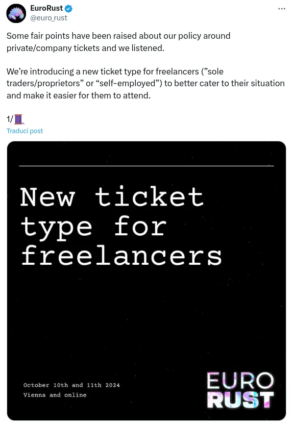

In 2023 I've decided to resign from my job at Prima to start working as a freelancer, with a particular focus on Rust, along with a minor web development. Currently I can affirm that for 90/95% of the time I work on Rust projects as a freelancer and I've noticed that only a minimum part of people, almost no one, works as a freelancer in Rust development, which is really a pity in my opinion, and now I'll explain you the reasons.

## How I became a Rust Freelancer

### I was tired of PHP

> It's always about **PHP**

As a Rust enthusiast I've always dreamt in the last years to have a real full-time Rust job. When I joined Prima in 2021 I had the possibility to start using Rust at my workplace and I was so happy with that, but it was Rust at 30% I'd say, mixed with Elixir, Elm and unfortunately, a lot of PHP.

I have no problem saying that Rust is, at least for me, the only language that allows me to write code like no other programming language out there. The way it gives me a tool to write clean code, reliable and fast applications it's just amazing. Because of that, I had no interest in working also with other languages. I wanted to work with Rust full-time.

As every Italian, I was really scared about starting working as a freelance, because I don't know about other countries, but at least in Italy everybody is scared of tax, so many people prefer to work as an employee; but I kept receiving Rust job offers, which hired as B2B and **the wage was like the triple of what I earned at Prima** so at a certain time I just decided to accept one and so I started my adventure as a freelancer contractor.

### From contractor to freelancer

> Well, if you work 100% for a company and you're hired with a B2B contract, you're still not a freelance, but a contractor.

So after starting my adventure as a contractor, a fire started burning in me: it was the enterpreuner spirit. I actually had some spare time, so I started to advertise my activity as a web designer.

Well that didn't go too well. Not because I'm not a good web designer, but because there were too many competitors (every freelancer makes websites), so I couldn't find many customers (I did some websites actually, which were also paid quite well), but I had to find my _niche_; and **I knew the best niche for me was Rust.**

So I set up a Google Ads campaing for "Rust software engineer" positions and immediately and with a very small budget I started receiving **many project proposal for small projects**.

## There is a huge demand for Rust freelancers

> I was confused: so there are not many Rust positions as employee, but there are many positions for freelancers?

Well, at least that's what I came out with. And it makes perfect sense actually: **Rust is relatively a young language and the industry is still experimenting**, probably companies are **still considering whether to adopt Rust or not** for long term projects. The industry is still not ready to take the risk to hire a full-time Rust engineer, especially in those countries where the work is highly protected (such as Italy indeed), so **they prefer to try with smaller projects and relying on freelancers**.

I do myself know many companies which are actively looking for Rust freelancers but can't find them, because most of Rust devs are still stuck on the employee positions, maybe not even working with Rust, but they wish to work with it.

### It's not all about cypto, but even if it was

I know what you may be about to say:

> But all the B2B positions are about Crypto

And yes, there are a lot of them, but it's not all about crypto.

I've worked with several companies, and many were just developing backend applications for their infrastracture, some others were developing IoT and embedded devices, and of course, I've also worked on many web3 projects.

But don't take me wrong, **I'm not a crypto guy**, personally I also think that 90% of the crypto projects are crap and just a craze. Anyway **there's nothing wrong with working for crypto projects**, even if you don't believe in web3. It's just a job (and payed a lot if you ask me), so even if in one year the crypto market collapse, there's no problem in working with these companies, _as long as you don't take part on scams and other illegal stuff_.

## We need to talk about Rust conferences

Before going to the conclusions, we need to talk about conferences.

This is an issue with conferences in general, when it comes up to freelancers that wants to go to conferences, not just those about Rust.

I know that **companies have a lot of money to spend to pay for tickets for their employees**, so I can understand an higher price for companies, **but most of conferences have totally forgotten about freelancers**.

In most of the case you have no choice between **paying as a private and spend a huge amount of money as a freelance, just to register the invoice for taxes**.

Thank God the problem has been pointed and some conferences have decided to finally add a separate ticket for freelancers
(kudos to [@eurorust](https://eurorust.eu/)), but many others still dont't have one (I won't make names, but **270€ for a ticket IT'S NOT OKAY neither for a private or for a freelancer**!)

## Conclusions

So I really think that for the moment, developers that would love to work full-time with Rust should give a chance to B2B positions, especially you, europeans! We need you, currently most of the devs I see working with B2B contracts are from Asia and Africa, but there are a very few from Europe and basically no one from USA! Why are you still struggling with PHP?
