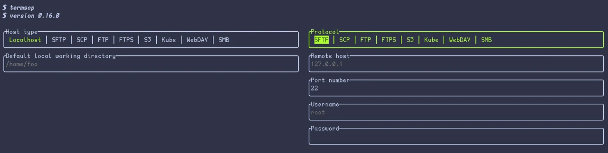
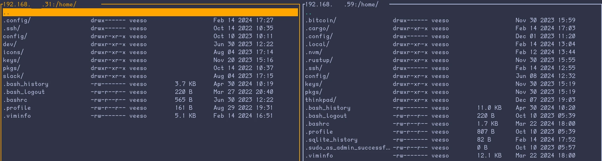

## What's new

So let's see what's new in this version 0.16 of [termscp](https://termscp.veeso.dev/).

Don't you know termscp yet? Come discover this [amazing project on Github](https://github.com/veeso/termscp).

### Multi host transfers

#### What is multi-host

So currently termscp could only work with a remote in the following way

```txt
|-----------|           |--------|
|           | --------> |        |
| Localhost |           | Remote |
|           | <-------- |        |
|-----------|           |--------|
```

But, what if we could link two remotes?

```txt
|----------|           |----------|
|          | --------> |          |
| Remote A |           | Remote B |
|          | <-------- |          |
|----------|           |----------|
```

#### How it works

Clearly, it is impossible to directly link two remotes, because they don't run termscp, but we could make termscp in two modes. One is as-is now with Localhost and Remotefs, and the other one would be like this

```txt
|----------|
|          |
| Remote A |
|          |
|----------|
  ^     |
  |     |
  |     |
  |     v
|-------------|           |----------|
|             | --------> |          |
| Host Bridge |           | Remote B |
|             | <-------- |          |
|-------------|           |----------|
```

So this would require a new trait like `HostBridge` to provide the same methods as the current `Host` and then we would implement a `RemoteHostBridge` which interacts with `remotefs` to the RemoteA which is mapped by the Host bridge.

#### Changes to UI

From now on when you run termscp the UI looks as this:



So the right panel is basically the same as it was, while the new panel is the panel on the left, which by default is set to `Localhost` host type, but can be changed to any other protocol, like this:


and then once connected you have the two panels as it used to be with localhost:



### Dot Dot directory

So apparently many of you wanted to see the `..` directory on the top of the list in the explorers to go the parent directory, so here you go; finally I've implemented it.

### Minor changes

- Migration to tuirealm 2.x, which has ratatui updates and the UI is now more responsive
- The new version alert wasn't displayed anymore, but unfortunately until the next version you won't see it fixed.
- Fixed a vulnerability due to the use of the `users` crate. Now we have `uzers`.

---

I hope you enjoy using termscp, and if you encounter any issue, don't hesitate to report an issue on [github](https://github.com/veeso/termscp).
