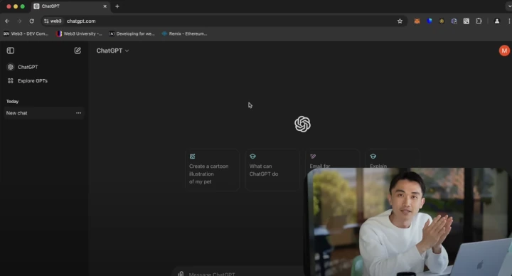
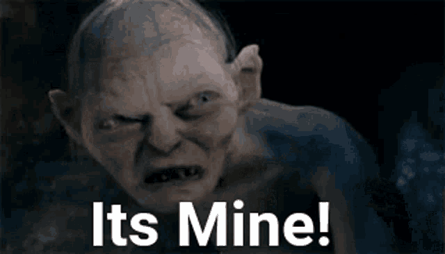

Diversi mesi fa scrissi questo articolo: [L'affascinante truffa dei bot MEV su Ethereum](https://blog.veeso.dev/blog/it/the-fascinating-ethereum-mev-bot-scam/), in cui andavo a livello molto tecnico a smascherare una truffa che si ripete ormai da anni su social come X.com o YouTube e che consiste nel deploy di smart contract su Ethereum che una volta lanciati dovrebbero garantire entrate da capogiro al creatore dello smart contract.

Come andavo ad analizzare in quell'articolo, la **truffa** consiste che in maniera abbastanza velata, lo smart contract in realtà non fa altro che **prelevare tutti gli ETH presenti sul vostro wallet per trasferirli sull'indirizzo del truffatore**, il quale viene nascosto all'interno del codice.

> TL;DR
> **I MEV Bot esistono**, ma **non possono sicuramente girare come Smart contract su Ethereum**.
>
> I **veri** MEV bot girano su **codice proprietario e non gratuito** e richiedono migliaia di euro d'investimento. Inoltre non hanno dei margini per forza così elevati.
>
> Ah infine **dal punto di vista etico** i MEV bot consistono nel **rubare denaro di sconosciuti**

## C'è bisogno di fare chiarezza

Da quando ho pubblicato l'articolo a gennaio 2024, ho ricevuto _numerosi_ messaggi da parte di diverse persone contenenti qualcosa del genere

> Ho trovato un video di un bot MEV che non sembra il solito Scam, anzi questo blah blah blah, questo è il link (...) riusciresti a dirmi se funziona veramente o è una truffa? Pure i commenti sotto sembrano reali.

Dalla quantità di messaggi come questo posso evincere che nel mio articolo precedente non sono stato abbastanza chiaro, che **tutti questi video che promettono di gauadagnare un sacco di soldi tramite MEV bot** sono uno **scam**, senza alcuna eccezione.

Andiamo a visualizzare quindi uno di questi video che mi sono stati inviati per capire da cosa possiamo evincere che è uno scam.

Il video si presenta con questo fantomatico **Chao Web3 Developer** che si fa vedere in webcam mentre spiega il codice. Se ci mette la faccia sarà affidabile no? Assolutamente no, anche perché **qui la faccia non ce la sta proprio mettendo nessuno**. Il ragazzo in questione infatti **non esiste**. Infatti **il video è generato con l'AI**, basta vedere il **movimento delle labbra** e la pelle troppo lucida ed infine, fate sempre **attenzione alle mani**.

Le mani sono estremamente difficile da renderizzare con l'AI, che crea sempre situazioni strane.

Guardate il pollice della mano sinistra: è semplicemente troppo innaturale, non solo è troppo rigido per essere in quella posa, ma è addirittura piegato all'indietro. Persino io che ho le dita particolarmente flessibili, fatico ad assumere quella posa.

La persona che mi ha contattato mi ha anche detto:

> Ma i commenti sembrano veri

In realtà ne ho visti tanti di video come questi, e vi posso garantire che i commenti sono sempre gli stessi. Sono ovviamente commenti comprati, ma non in maniera casuale. Infatti i commenti non sono del tipo "Wow, amazing, works for me, I'm writing this comment from my lambo", ma fungono più da **faq**. Se ci fate caso infatti i commenti sono strutturati come domanda/risposta.

> D: I've never used metamask - how do I exchange EUR for ETH?
>
> R: Moon Pay or the same services

oppure

> D: The Pc must be turn on?
>
> R: The bot runs on the Ethereum network not on your PC, so no you can turn off your PC in the meantime

### Come spieghi però il codice generato da ChatGPT

Infine spesso in questi video, _la persona_ che spiega, vi mostrerà un codice, magari generato da ChatGPT e quindi potreste giustamente chiedervi: "Ma quindi ChatGPT crea codici per truffarmi?" e la risposta è: no, assolutamente no. I punti sono due:

1. A chatGPT non viene chiesto di generare quanto vi viene promesso, ma tutt'altro
2. Il codice che vi viene detto di usare è diverso da quello generato da ChatGPT

Quindi la sentenza finale ed inequivocabile è: **I MEV Bot che girano su Ethereum come smart contract sono TUTTI UNO SCAM**.

Potreste quindi chiedermi, ma perch? Non è che magari ci sono eccezioni? Andiamo quindi a vedere perché...

## I MEV Bot su Ethereum non possono esistere

Innanzitutto parto con il presupposto che la maggior parte delle persone che sono incappate in questi video neanche sappiano cosa sia un MEV bot.

Un MEV Bot (dove MEV sta per **Maximum Extractable Value**) è un programma che monitora le transazioni nella **mempool** (contenitore delle transazioni in una blockchain che attendono di essere incluse in un blocco) riguardanti il pool di liquidità di **exchange come Uniswap** (DeFi) al fine **spremere** soldi dai trader. Ma come?

- **Arbitraggio**: Compra in un pool dove il prezzo è basso e vende in un altro dove è più alto.
- **Front-running**: Vede che qualcuno sta per fare una grossa operazione, tipo comprare un sacco di ETH, e inserisce la propria transazione prima per trarne vantaggio.
- **Sandwich Attack**: Inserisce una transazione prima e dopo quella della vittima per manipolare il prezzo e guadagnarci.

Quindi alla base di tutto ci sta il fatto che il bot debba essere capace di **leggere continuamente le transazioni presenti nella mempool**.

Ma allora perché non è possibile farlo come smart contract su Ethereum? Fondamentalmente abbiamo 3 motivi:

1. Gli smart contract su Ethereum **Non hanno modo di leggere la mempool**, e non solo: gli smart contract Ethereum non possono accedere a nessuna risorsa esterna (neanche ad internet per intenderci). Quindi capite che se non possono leggere la mempool, sicuramente non potranno fungere da MEV bot.
2. Velocità e performance: i MEV bot veri richiedono performance elevate, mentre gli smart contract su Ethereum hanno performance bassissime.
3. Gas fee: far funzionare uno smart contract su Ethereum è **molto costoso**. Ogni operazione, anche la somma di due numeri in uno smart contract **si paga** (e non poco!); **far girare un MEV bot su Ethereum costerebbe migliaia di dollari al minuto!**.

## Come si fa veramente a guadagnare con i MEV Bot?

Ma allora i MEV bot esistono? E quindi quali sono le alternative?

Premetto che **non sono né un esperto di MEV bot**, né lo considero **etico**. I MEV bot nella loro funzione in un certo senso rubano agli altri utenti.

> 💭 **Immaginate questo scenario**: andate ad un compro oro per vendere l'oro di un vostro parente recentemente deceduto. Avete 30g d'oro che il compro oro **vi paga 50€/g, quindi 1500€** in tutto. Siete felici e accettate, ma mentre fate la transazione il **MEV bot entra in funzione** ed il prezzo dell'oro, magicamente senza che voi ve ne siate neanche accorti, viene modificato in 35€/g. **Senza neanche poter controbattere vi vengono dati 1050€ invece di 1500€**.
>
> Certo ora potreste dirmi che nel mondo reale una cosa del genere **non è possibile, ma sulla blockchain sì**, in quanto non è un settore con particolari **regolamentazioni**.

In sentesi questo è l'aspetto etico del MEV bot, quindi riflettete se volete veramente continuare a leggere questa parte 😅.

### Quali sono i requisiti per un MEV bot?

- **Un hardware potente**: I veri giocatori di MEV bot usano server dedicati o persino collocano macchine vicino ai nodi della rete Ethereum con perfomance notevoli. Parliamo quindi di macchine che costano migliaia di euro.
- **Tanti soldi** da pagare in **gas**: Per competere con altri bot, devi offrire delle **bribes** (mance) ai validatori per essere inserito per primo nei blocchi, in quanto devi essere più veloce dei trader e degli altri bot. Questo riduce i margini di profitto.
- **È un gioco a somma zero**: Se ci sono altri bot in competizione, i guadagni calano drasticamente. Se perdi, butti soldi nel gas.

Ah, inoltre **non dimentichiamoci del software**. Il software del MEV bot **non sono poche righe da copia-incollare da un video di YouTube**, ma bensì sono programmi molto complessi e soprattutto **proprietari**. Infatti **nessuno ha intenzione di venderti il suo MEV bot**, figuariamoci regalartelo: **più bot ci sono, minori sono i guadagni**, quindi capite bene che chi possiede il codice di un bot se lo tiene ben stretto.

Quindi o hai competenze software eccellenti più migliaia di euro da parte da potenzialmente buttare via o più probabilmente **questo non fa per te!**
