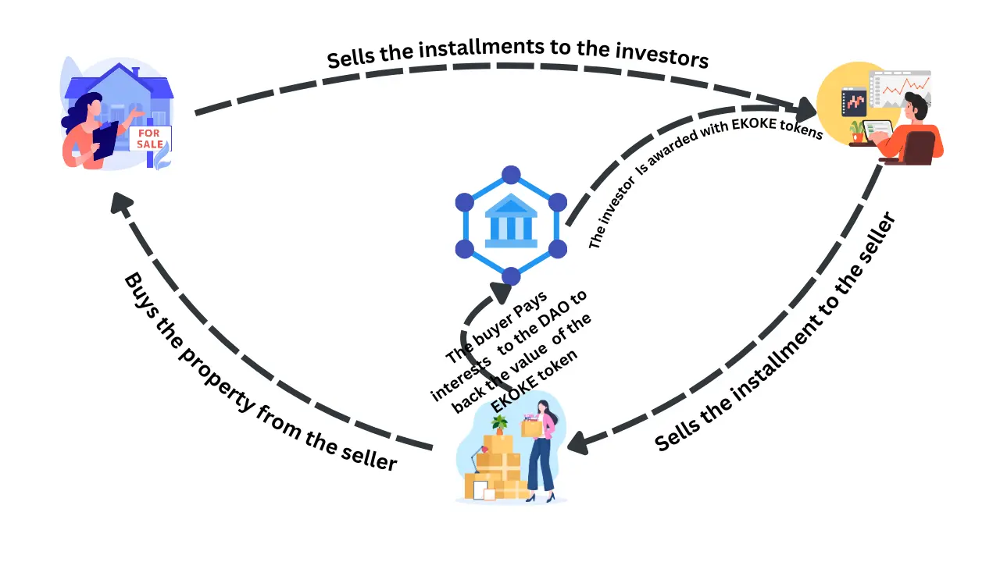

## Introduction

So in the last year I've been working a lot on the development of the [**EKOKE DAO**](https://ekokedao.com) project. I am the main software engineer of the software and I've personally designed the project architecture and implemented most of the codebase.

Now we're finally going to launch the project after more than one year of hard work, so let me introduce you **EKOKE DAO**.

## What is EKOKE DAO

EKOKE DAO is a system which has the potential to **revolutionize** how people buy and sell real estate properties.

### The problem we want to solve

Currently real-estate are mostly sold with payment of the entire amount of the property price or with a **mortgage**.

The problem with this, is that mortgage has recently become problematic due to the **increasing interest rates**.
Mortgages with variable rates can even lead to the buyer to pay a sum which is up to **the double of the property price**!

In a scenario where **young people can't afford to buy real estate** as it used to be in the past decades, **dealing with mortgages has become an issue**.

What if we could have a system which would allow us to pay for real estate properties with installments and a fixed rate of interests?

### Here EKOKE DAO comes

With EKOKE DAO we've implemented a decentralized system which allows everyone to buy a house with installments
and with a **fixed interest rate between 5% and 15%**.

But how is this achieved?

### Sale Process

1. For each property sale we make the **agency**, the **buyer** and the **seller** to sign the sale contract, which contains the following information, which are agreed by the parts:

   - price of an installment
   - amount of installments
   - contract due date

2. Our DAPP (an application running on the blockchain) registers the sale contract on the ledger and mints an **NFT**, called **Deferred** for each installment. All the minted NFTs are given to the **seller** of the property.
3. The **buyer** periodically goes to the **Marketplace** and buys the next token with USDT.

But how can this be any good? What's the **advantage for the seller** and how can the community partecipate into this if this is a DAO?

Let's see how!

### Let's talk about the tokens first

In the **EKOKE DAO** Environment there are **3 different okens**:

- **Deferred**: Deferred is a NFT token (**ERC721**). **Each token** represents an **installment** of a sale contract. Deferred tokens are **minted** when a **sale contract is created**. There is a token for each installment and they have a fixed price expressed in dollars. They are initially owned by the property seller and they all must be bought by the property buyer in order to pay the seller.
- **EKOKE**: EKOKE is a fungible token (**ERC20**). The EKOKE token is used as a reward for investors who _lend_ money to the buyer. The total supply of EKOKE is set to **8,880,101.01** tokens and the reward given to the investors will decrease over time automatically with a predefined algorithm.
- **EKOGOV**: The token for the governance of the EKOKE DAO.

> Note: the deferred smart contract is shared over all the sale contract, so there isn't a Deferred smart contract for each sale contract!

### Lending - Everybody can pay for the installments

All the NFTs, as long as they are still owned by the **seller** can be bought by **anyone** on the marketplace, but why is that?

We've said before that **investors** (the third-party who buys the NFT) can _lend_ money to the property buyer. This is achieved by buying the **Deferred** token on the Marketplace.

At this point the **investors** will immediately receive the reward with **EKOKE ERC20 Token**.

Of course the money the **investor** spent for buying the **Deferred NFT** are not lost! He will be paid later by the **property buyer** when he's going to pay that installment.

And **all of that is done automatically**! **You don't have to list the token by yourself**, the token is **automatically listed** on the EKOKE DAO marketplace, and it'll stay there until the buyer hasn't bought it from you.

### The use of the EKOKE Token

The use of the EKOKE token is the one of an **asset** which **should increase in value over time naturally**, let's see why:

1. The amount of rewards given to **investors** decreases after each contract which is created. This means that for example the first sale contract could have a reward of **50 EKOKE** for each NFT bought. The second sale contract will have for instance **49 EKOKE**, the third one **48.5** and so on. This makes extremely convenient for a user to buy an installment, because the reward he's going to receive will increase over time in value.
2. The amount of EKOKE tokens is capped to **8,880,101** tokens. This makes the EKOKE token scarce.
3. Once the reward pool has run out of tokens, **sellers** or **buyers** will have to burn tokens to make the reward pool to work. That's why there is a **Reward Pool** which at the creation of the EKOKE token will hold the 66% of the max supply, but everytime a reward is given away, its liquidity will decrease, and once it will reach 0, users will have to burn tokens to make it capable of minting new tokens for rewards.

## It's a Win-Win system for everyone

The EKOKE DAO provides a system which is a Win-Win for **Buyers**, **Sellers** and **Investors**:

- **Buyers** can pay for their homes in manageable installments with low and fixed interest rates.
- **Sellers** get rewards for using the EKOKE DAO and can sell the property at a higher price since the buyer can afford to pay more without the higher interest rates.
- **Investors** get a reward which works as an asset which price will increase during time.

## The role of the DAO

There are many way each actor can contribute to the EKOKE DAO:

- **Developers**: Developers can contribute by improving the code of the EKOKE DAO project through the Github repositories. EKOKE DAO's codebase is **100% open-source** and everybody is welcome to contribute to it.
- **Real estate agencies**: Real estate agencies are invited to join **EKOKE DAO** to start proposing properties to be sold on our infrastructure. Real estate agencies **must submit a registration form and must then be approved by the DAO** to be approved. Once real estate agencies are approved they will receive a **reward** in EKOKE tokens for joining.
- **Real estate properties sellers**: People who wants to sell their real estate properties are welcome to opt for using EKOKE as their media to sell their properties. Sellers are awarded by agencies with rewards if they sell their property on EKOKE. You can refer to our Partner agencies page if you need to find agencies.
- **Real estate seekers**: Whoever wants to seek for a house without paying huge amounts of mortgage interests with the traditional bank system, can join EKOKE to seek for a property and opt for paying with installments with a low fixed-rate interest rate.
- **Community**: The EKOKE community can contribute in two very simple ways:
  - **Buy Deferred Tokens**: The community main purpose is actually to buy Deferred tokens on the EKOKE DAO Marketplace.
  - **Voting**: The DAO will give everyone the right to vote. Voting will allow everyone to choose for these kind of things:

### Voting

The community will be able to vote using the **EKOGOV** token on the DAO. The DAO will basically have three main roles when voting:

1. **Real-estate agencies submission**: the submission of an agency in the DAO will go through voting on the DAO.
2. **New feature Pull requests**: Pull requests which introduce major changes and new features to the DAO will be voted.
3. **Refunds for frauds**: In case of frauds, the DAO will vote to approve withdrawal from the Liquidity Pool to refund frauded investors.

## Launch

The launch will be on the beginning of **2025**, with the following schedule:

- **January 7th, 2025**: a Giveaway will be held on the [EKOKE DAO Website](https://ekokedao.com/giveaway) where 50 persons will have a chance to win **100 EKOKE** tokens, for a value of **100$**.
- **January 15th, 2025**: The EKOKE Presale will be held on the [EKOKE DAO Website](https://ekokedao.com/presale). The presale will last for **3 month** and will have a starting price of **1 EKOKE = 1 USDT**. The price will increase by **1 USDT** each **20,000 EKOKE** sold.
- **Q2 2025**: The EKOKE DAO will be launched and the first sale contracts will be created.
- **Q2/Q3 2025**: The EKOKE DAO will be fully operational on the NNS so everyone will be able to partecipate in the DAO governance.

## Conclusions

Don't miss the opportunity to join the EKOKE DAO project. It's a project which has the potential to revolutionize the real estate market and to make it more sustainable and fair for everyone.

So what are you waiting for? Join the EKOKE DAO project now!

[**Join EKOKE DAO**](https://ekokedao.com)

And follow us on [X.com](https://x.com/ekoketoken) and [Telegram](https://t.me/ekokeTOKENgroup) to stay updated with the latest news about the project.

