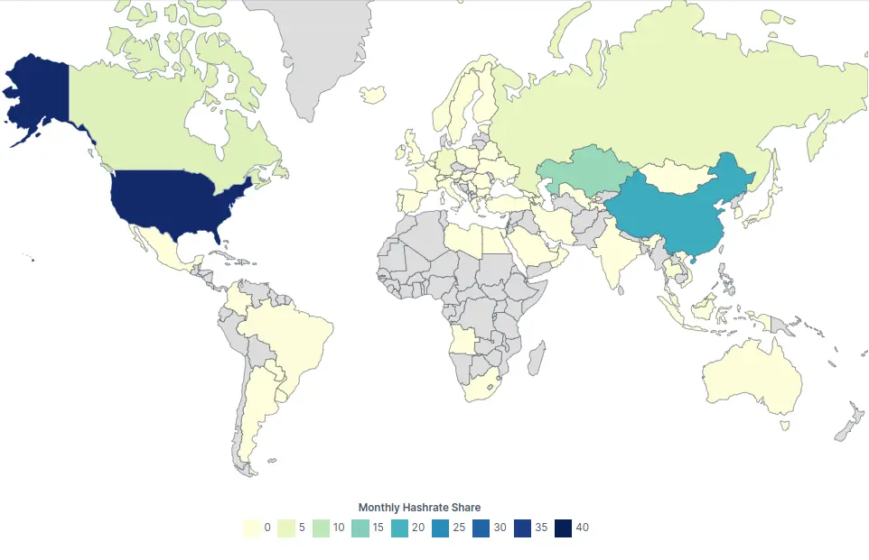

## Bitcoin is decentralized, right?

So yesterday I was scrolling my feed on LinkedIn, a thing I usually do once a month, and I found this:

So in the image above you can see a chart showing the Bitcoin distribution over different entities.

The chart is showing that **57%** of the Bitcoins are owned by _individuals_. This is a good thing, right? It means that Bitcoin is decentralized, right?

Well, it isn't a lie, but it isn't the truth either. It's just a convienent way to represent the data in order to make it look decentralized.

Do you want to see the real data?

## Bitcoin token distribution

So here you go, this is the real bitcoin supply distribution by amount of tokens owned by each entity:

(Data from [statista.com](https://www.statista.com/)).

If we give a look to the distribution we can easily get concerned about how centralized Bitcoin really is.

Out of a total supply of 21 Million, we need to subtract the remaining 1.2 Million of bitcoins that still have to be mined.

So out of the 19.8 Million Bitcoins, we have:

- **1 Million** owned/lost by **Satoshi Nakamoto**
- **5 Millions** which are probably lost forever or owned by Nakamoto as well.
- **2.4 Millions** owned by **Humpback** (more than 5k BTC) and exchanges. These are owned by very few people.
- **3.4 Millions** owned by **whales** (more than 1k BTC)
- **1.2 Millions** owned by **sharks** (more than 500 BTC)
- **2.2 Millions** owned by **dolphins** (more than 100 BTC)
- **0.8 Millions** owned by **fish** (more than 50 BTC)
- **1.6 Millions** owned by **octopus**(more than 1 BTC)
- **1.6 Millions** owned by **crabs** (more than 1 BTC)
- **1.8 Millions** owned by **miners**
- **0.9 Millions** owned by **normal** people (shrimps), which own less than 1 BTC.

Said so, we can see that the distribution is very centralized, with the majority of the supply owned by a few entities, while for the rest of the people, even including the crabs into those, we have just about the **11%** of the total supply for us. Money of the people, right?

Okay, you might think that it's the same with the FIAT money.

Well, while it's true that 1% of the population owns 50% of the wealth, the difference is that with Bitcoin, the distribution is even more centralized. We estimate that **90% of the Bitcoins** is owned by about **50k people**.

Just to make a comparison, the **1% of the world population** is about **80 Million** people.

## What about miners

Okay, but what about miners? They are the ones that keep the network decentralized, right?

Well, not really. Miners are the ones that keep the network secure, but they are not the ones that keep the network decentralized.

Indeed the miner distribution is not even close to be spread around the world or to individuals. The majority of the miners are located in the United States and in China, and the majority of the mining power is owned by a few entities.

(Data from [statista.com](https://www.statista.com/statistics/1200477/bitcoin-mining-by-country/)).

There was even a time a couple of years ago, when more than the 51% percent of the miners were located in China, a nation that is not really known for its democracy. If the Chinese government would have decided to take over the network with a 51% attack, they would have been able to do so.

Also, there are many concerns about the decentralization due to the difficulty of joining the mining network. The mining network is controlled by a few entities that have the money to buy the hardware and the electricity to mine the bitcoins.

Mining is **unsustainable**, **expensive** and **unfeasable** for the majority of the people.

### But we have the validators though

Okay, but we don't need miners to keep the network safe, we just need validators, right?

Well, this is a complicated topic. While it's true that validators actually can check whether the job done by the miners is legit and everybody can run a validator on their own without any big investment, it's not clear the role they can actually play in case the miners would decide to do something bad.

If the miners would join a lobby and modify the code to make the network centralized, the validators would have no power to stop them, since most of the people would just keep using the network as it is.

Of course, this, which is a hard-fork is something which has already happened in the past, and up to now it has always caused new blockchains to be created, like Bitcoin Cash, Bitcoin SV, etc. more than changing the original one.

It's also true though, that at the time the mining environment **was still more decentralized than now**, and with the **increasing cost of running miners** and the **decrease of rewards** for them, will most likely lead to a more centralized network, where this kind of attacks could be more likely to happen.

## Not a P2P cash system - There are more intermediaries than you think

So, in practice things aren't going well, but on paper things are good.

Well, one thing I always hear about Bitcoin is, while using FIAT currency, if I want to send money on the other side of the world, I need to go through a lot of intermediaries, while with Bitcoin **I can send money directly to the other party**.

But, no, **it just doens't work like that**.

Every single transaction (which is defined as the exchange of BTC between two or more parts) is recorded on the blockchain, and this process requires miners to compete to create a new block with your transactions in it.

How many nodes does your transactions go through? **All of them actually**. And not only miners, but also validators later.

The amount of **actors involved in a Bitcoin transaction is actually much higher** than the one involved in a FIAT transaction.

## The only P2P thing about Bitcoin

But there is one thing that is actually P2P in Bitcoin, which is the network.

Of course the networkrun on a P2P basis, but this is not something that makes Bitcoin decentralized.

This just means there is not an entity that controls the network, but it doesn't mean that the network is decentralized.

Decentralization is a concept way more complex than just having a P2P network, and involves the amount of parties involved and their attributes (such as power, money, location, interests in the governance, etc.).

## Is there anything really decentralized out there?

Well, it's quite complicated. We can say for sure none of them is popular or widely used and none of them has surely solved the issue with P2P transactions.

If Bitcoin gets often compared to cash transactions, we can't say anything like that currently exists in the crypto world.

The reason is that we don't currently have a system that can trustlessly exchange value between two parties without the need of a third party on the network.

There may be some technologies in development to achieve this, but they are still in their infancy and not widely used.
