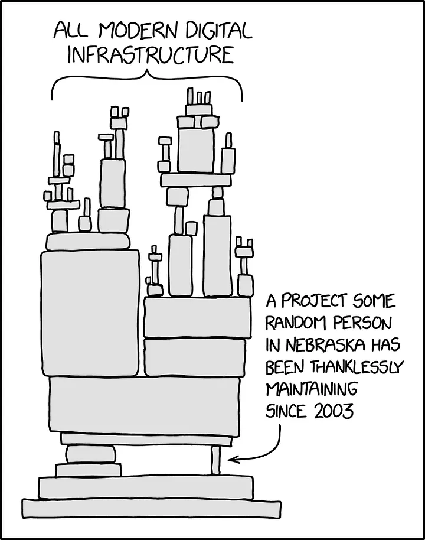

## Preamble

It’s November 2020, and several NodeJs services suddenly stopped working. The panic spreads across the community, immediately someone points the finger to a possible wide-spread NPM package which is probably used by most node applications. They found out that a developer named Marak Squires decided to sabotage two of his projects, faker.js and color.js. After that NPM, yanked the two sabotaged versions and blocked Marak from publishing new updates for his projects.

Many devs opened issues on his projects pointing out what was preventing the libraries from working, and interestingly nobody thought that he deliberately decided to sabotage the two projects, but after that, he opened issue 1046 on faker.js Github’s page, which stated:

> No more free work from Marak — Pay Me or Fork This
>
> Respectfully, I am no longer going to support Fortune 500s ( and other smaller sized companies ) with my free work.
>
> There isn’t much else to say.
>
> Take this as an opportunity to send me a six figure yearly contract or fork the project and have someone else work on it.

This opened a huge debate regarding the sustainability of the open-source community and whether companies should support developers.

## Should we expect to be paid for our open-source work?

Thousands of devs around the world have developed incredible projects over many years, and most of them still don’t receive the recognition they deserve for what they did.

I can even talk for myself, even if I didn’t develop any huge open-source project, I’ve collected thousands of stars on Github, but I earn less than 50$ per year. Furthermore, I often get issues opened on my repos with people expecting me to satisfy their requests in a short time and as they want. Once I decided to say “no” to one feature request and I’ve even been told that I had a “disappointing attitude” for saying that. After that, I eventually decided to implement the feature, but I got nothing back.

And believe me, I spent **thousands of hours** on my open-source projects.

Did I do it for money? Absolutely not, I want to be clear on that. I think the major motivations for an open-source dev to put all this effort should primarily be for reasons like:

- **self-learning** and improvements in their skills.
- **to learn something new**, which is something that often we don’t have time for, at work.
- to have something to **show to recruiters**.
- **for fun**, because we love coding.

But obviously, I can totally understand seeing many users relying on your projects, especially when your users are big companies, can lead to a lot of frustration if you don’t receive a cent for all the effort you put into your work.

**I’ve also read sometimes, that we shouldn’t expect any support, since we’re not going to provide any guarantee for what we do.**

And that’s somehow something I agree with. The software licenses we use for our projects (such as the MIT license), always state something like

> THE SOFTWARE IS PROVIDED “AS IS”, WITHOUT WARRANTY OF ANY KIND, EXPRESS OR IMPLIED, INCLUDING BUT NOT LIMITED TO THE WARRANTIES OF MERCHANTABILITY,FITNESS FOR A PARTICULAR PURPOSE AND NONINFRINGEMENT

which makes our projects somewhat “unreliable”. We’re not providing a service to any company, we’re just stating that our code should work.

Basically open-source is the opposite of a contract: whereas the contract requires you to get the project working and done and you get paid for that, the open-source license doesn’t bind you to any obligation and so companies don’t have to pay for your work.

_So, the case is closed and it’s okay not to pay open-source devs, right?_ **Of course not.**

The problem is that unfortunately (or not) every project, **no matter if open-source or commercial**, totally relies on thousands of thousands of open-source projects. And we as developers ignore that.

- We ignore the potential risks of relying on code that potentially could be unsafe
- We ignore the fact that these projects are being developed by workers unreckoned for their job.

And we can’t think of replacing all our open-source dependencies with closed-source homemade implementations, both because it would require decades to replace everything, and also because it probably would be less efficient, reliable and safe.

The only solution we have is to create a sustainable open-source community where the developer’s work is recognized economically.

## What solutions do we have right now?

### Software Foundations

Yep, maybe you didn’t know that but software foundations exist for open-source projects and they do actively run as intermediaries between companies and open-source projects. They raise money from both other dev’s donations and from companies and what they do with a fraction of this money is donate them to open-source projects.

It looks great, problem solved? Unfortunately not, I mean, I think software foundations are great and we love them, but there are mainly two issues with that:

- they don’t raise enough money to support a decent amount of devs.
- they usually support only major projects. This means that unless you have developed tokio, you probably won’t see any money from them.

> I’m not saying they’re evil, I’m just saying they don’t have enough resources to support everybody.

### Hiring open-source devs

Tech companies **could change their way of hiring developers**. I’m probably going to write an article on the awful hiring system for devs in a future post (so stay tuned), but what I can say right now is that most of the companies don’t even look at your GitHub profile, even if you spam it on your resume and LinkedIn. And that’s just **sad**.

It would be such a good way of recognising developers if a company using one of your projects contacts you to **propose a job**.

Unfortunately, this rarely happens. I’ve attended many interviews in my career but nobody gave a `****` about my open-source projects.

### Companies should support open-source projects

### Forget what I've just said

Okay, everything looks so nice and easy, but it’s not. Unfortunately, these are just words, and things won’t change, because actually, we can’t do much to make these things happen.

Furthermore, this is just another example of how we keep blaming others for not having a sustainable open-source community. Yeah, it’s just like for the environment, everybody keeps saying it’s China’s fault, but then we eat meat every day.

What we can ACTUALLY do

## What we can actually do

### Become an active supporter

This is probably the most ignored way to play your part in open-source community sustainability.

Everything started with the story of Marak and many others, as the Log4J exploit. I thought that it was unfair that nobody gave us a single penny for what we do and I started to think of how an open-source community could become sustainable.

But I also realised another thing. **I’ve never given a single dollar to any other developer.**

So how can we think of a sustainable industry, if first, we don’t set a good example?

So starting from this year, I’ve decided to play my part: **I will donate 5$ each month to a different open-source project that I’m grateful for.**

I know what you’re thinking: **“wow, such money”**.

I know it’s **nothing**, but **how many of you are actually donating money to open-source projects?** What if every one of us would donate 5$ to a different project each month?

And I would even love to be able to donate more, but my wage is still not so high, but whenever I’ll be able to do so, I will.

Being an active supporter is just not a matter of donating. If you really can’t afford it, raise awareness among your mates about this, and try also to bring to the attention of your company how much we owe to open source.

**The action of one can’t do much, but together we can build a better and more sustainable open-source community**, and I’m sure that this change must start with our commitment.
