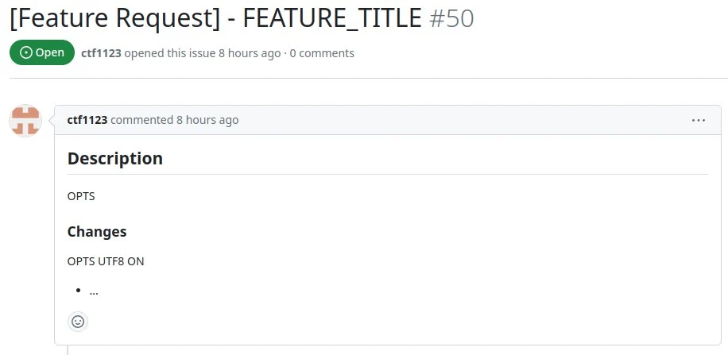

## Preamble

I started my journey into open-source almost 6 years ago and I've worked on several projects. Currently, I have 90 public repos on my GitHub and at least 5 of them have become quite successful over the years. It started as a hobby but it's now almost an unpaid job. Was it a waste of time? Let's dive in!

## From a hobby to an unpaid labor

### The beginning

In **2017** I had just started working at my first company and I was a super noob into programming. I had this project where I needed to develop a driver to communicate to a modem through the serial port and the driver needed to be Linux and Windows compatible. After implementing the Linux driver I realized that the Windows implementation for serial communication was totally different. So I came back home that day and decided to implement my first open-source project: termiWin. TermiWin is a termios porting for Windows and for some reasons, it became "popular" among the Chinese GitHub community (it's not popular, but at the time 50 stars for me was a huge achievement).

The project is actually trash and wrong in many aspects, indeed after a few years I even stated that in the [README](https://github.com/veeso/termiWin)

### The first successful project

But after that, I started to work on many other projects, which didn't go well actually, until I started to work on [termscp](https://github.com/veeso/termscp). **termscp** has been a **game changer** in my open source career, not only because the project is actually good and has become popular (it got even mentioned in different geek podcasts), but also because it was the starting point for many other projects. Basically, most of my popular projects used to be modules of termscp that at a certain time, I decided to migrate as standalone libraries.

Once I thought that expecting donations from open-source projects was somehow _wrong_. But after all those hours spent working on termscp I finally decided to start raising donations for my work. I still remember the first time someone decided to donate me 2 €. It felt so **good**, even if it was just 2 euros (tax excl. So it became like 1.42 € eventually).

### The burnout

But after some time also another problem started to raise: **issues**. I had like **10 issues opened each week**, mostly feature requests, but also bugs. I was used to fix them asap once, but at that point, I couldn't even find the time for me. **My weekends were entirely spent on fixing bugs and implementing feature requests**.

I fell into **burnout** after two months. I took a break of three months from open-source after that. Then I resumed my open-source projects, but this time with much more calm, slowly, and more relaxed, as it should be.

### The bill, please

Anyway, if you're wondering how much money I raised during all this time in donations, here's the sum: **about 45$ in 4 years** after enabling donations. **Do you know how many people opening issues and getting them fixed donated to me? None**.

So, now you have a clear prospective of how my open-source career's gone. But what have I learned? Was it a waste of time after all? Let's analyze the pros and cons.

## What open-source will give you back

**I cannot deny** that even after a **burnout** open-source has given me back **a lot**. Let's state it clearly: **doing open-source is NOT a waste of your time**.
Even if it may sound like a huge investment of time (and it actually is) that you'll never get paid back for, it is not like that.
Well, **actually you'll very unlikely get paid for your work with money**, but consider that **there are many other ways to get "paid"**.

### There's no other better way to learn new things

I've had the opportunity during my career of going to conferences, take courses, and learn from my job, **but nothing made me learn as many things as open-source development**. The point of open-source is that **you can work on whatever you want and that can make you learn an infinite quantity of things and on any topic**.

You may think that courses are good as well, but let's be honest, nothing is good as **learn-by-doing** and open-source in that is **excellent**, because you can actually work on real-world implementation of technology.

You can also take advantage of that to **change your sector**. For example thanks to open-source development, **I had the opportunity to start learning about web3** and that led me to join a web3 start-up in 2023. If it wasn't for my hobby, probably I would have never been able to join them.

Most of the things I know as a developer, are learned by open-source development.

### You will have a huge advantage in recruiting

If you do open-source, **your GitHub** (or whatever you use) **profile will become your showreel**.
You can't even imagine how many advantages this will bring to you.
Not only **recruiters will prioritize you as a candidate for your work**, but you'll also be able to skip the most annoying step in interviews: the **"homework exercise"** you have to do to prove you're good as a developer.

In all of my recent interviews, I've been able to be privileged as a candidate thanks to all of my projects. I didn't need anymore to prove how I was as a dev, because all of my skills were already there, on my GitHub.

In addition to this, **GitHub will also become an additional recruiting channel**: I often receive job offers from recruiters via GitHub, which means that it's very good for reaching that step in your career **where you're no longer looking for a job, but companies will be looking for you**.

### It is good for your morale

**Getting things done is always good for your morale**, and seeing **other people appreciating your job** is even better. That's how open-source works after all.
If your project is good other people will start appreciating your job and using it daily.
If you had a bad day at work, you can just think about that out there, there are other people using your product. And that will easily make you feel better.

## What you should be aware of

Unfortunately, it is not all good, and **working on open-source projects has its cons**. But, if you know what you should be careful of, you can easily avoid disappointments, stress, and even worse **burnout**.

So, let's see from my experience **what you should be aware of and what I've wished to know before** starting to do open-source.

### It will never be a job

In my opinion, **open-source development should always be kept as a hobby**.

Listen, I know what you're gonna say

> But hey, there are some people who actually made open-source their job!!!

YES, I do know. **BUT** listen to me. There are mainly two problems here:

1. **You need money to live**. I don't have an exact number, but I think that **less than 0.1% of your users will donate at least 1$**. That's the sad truth, not even mentioning that these donations may not be periodic, so they might be one-time donations. So basically if you want to make it a job, **you need supporters who donate monthly** and let's say that **backers are 1 out of 10.000**, how many users will you need to get a decent salary from your donations? Not to mention that the salary must be convenient compared to your current job. In addition, to start accumulating backers, you'll need **a lot of time**, which probably you don't have if you already work for a private company. So good luck with that.
2. **You depend on your users**. What does it mean? It means that if you used to do open-source because that made you able to do whatever you want, now you need to satisfy your community. **Your community will expect you to fix bugs, implement their feature requests**, and provide them with new software made to satisfy them. **And if you don't satisfy them, they will stop backing you**, which means no more money. So, if you reach this point, **does it even make any sense to do open-source anymore?** Are you still _free_?

### People are ungrateful

Another sad truth. But you need to accept that **most of people are ungrateful for what you do**. I can't even remember how many times I got frustrated of people opening issues, getting them fixed, and not even got a **tip**, most of the time **not even a "thank you bro"**.

Oh, and not only that, but in most of the cases your users will make you **waste a lot of time** in getting these issues fixed. Maybe you've prepared that **beautiful template for issues and PRs**, well forget that. Based on my experience **about 40% of users that open an issue, will just blank your template and provide you with an insufficient amount of information about their issue**. In **5% of the case the issue title was empty**, **20% of the times the description was empty** and in 10% of the cases **the title was totally misleading**.

I'm talking about things like this:

And after struggling with that, in the remote case there was actually an issue with your software, you close the issue, release the new version and **you'll never hear back from them 90% of the times**. Not for an appreciation nor for a feedback. Good, right?

### People are also lazy

I swear I do love people! Even if doing open-source will make you hate them. And the reason why, is not only people are ungrateful, but they're also lazy. Most of the time your community will prefer to report an issue for a very easy-to-fix issue, than trying to fix it with a PR, even if the last one will probably take less time to do.

### Documentation is good, but useless

I've written pages and pages of documentation and user-manuals for my software, that **apparently most of my users, have never read**. Most of the issues tagged as **questions** on my repos would get answered just by reading user manuals, which started to make me think that most of them don't read the manuals. So yeah, expect that people won't spend time reading your manuals, as opposed to you, who've spent many hours in redacting it.

### You should never become a yes-man

There's nothing worse than becoming a slave of your community when dealing with open-source projects.

If a user asks you for a feature or even worse has already implemented it in a PR, don't hesitate to say you don't want that implemented if you don't like it.
I don't mean you should be a despotic dictator when it comes to your projects. **It's good to accept improvements if they actually bring something useful** to your projects, even if you may not find that feature useful for yourself. **BUT** if someone suggests something that would really take a too long time to implement or you really think it's not only unnecessary but also would make it worse, don't hesitate to just say **no, thanks**.

**Don't hesitate even if the user has already implemented it in a PR**. It's not your fault! **It's always a good practice before opening a PR, to open an issue first** asking for feedback from the project maintainers and the community.

### You owe nothing

Last, but not least important. **You owe nobody nothing**. **It's your time, it's your project, people are not paying for it**, so don't feel to owe your commitment to your community. If you need to take some time for yourself and take a break from open-source, take it with no hesitation. **If you want to give up, you should be able to do it whenever you want** (maybe leave a note first on your readme, it's a good practice).

It took me a while and a burnout to understand that, but then I started to take it differently. As I said before, I took a long break once, and during that time I realized how I became a slave of my own users. I resumed to have a social life during that period and I could even find a girlfriend, which I felt I didn't have the time before.

As I said before, keep it as a hobby, take your time, and find your balance.

## Conclusions

I hope this blog post was useful. I know it may sound like there are more cons than pros, but trust me, it's not like that. Open-source is fun and is really a booster to your career, but you should really take care of your mental health while doing that, otherwise, your community will consume you and that will lead you nowhere.

This is my first post about my experience in open-source development and I hope you enjoyed it. I will soon start writing a new article on **how to develop a successful open-source project**.
