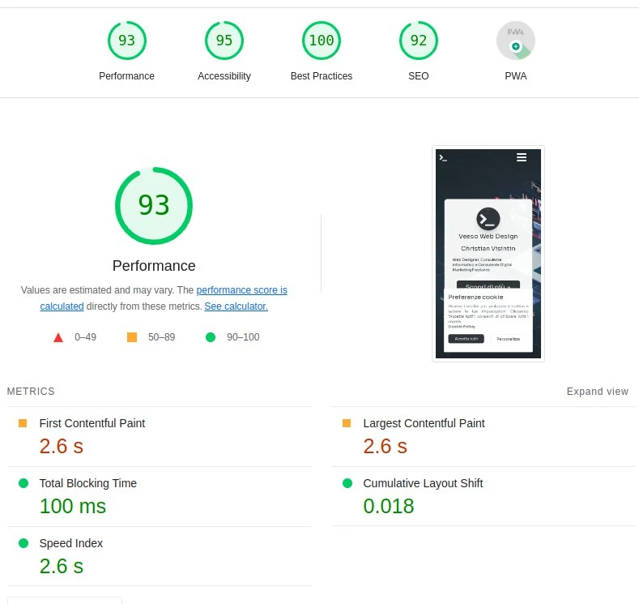

## Perché migrare il tuo frontend ReactJS a Gatsby

Hai un sito che è interamente sviluppato in React senza nessun render server-side? E per caso il tuo sito è perlopiù statico? Beh, in questo caso dovresti davvero considerare di passare a Gatsby.

Ma cos'è Gatsby?

Allora, se non hai mai sentito parlare di Gatsby, lascia che te lo presenti:
Gatsby JS è un framework all'avanguardia per lo sviluppo web, open-source, che sfrutta React e GraphQL per aiutare gli sviluppatori a creare siti web e applicazioni incredibilmente veloci e performanti. Ciò che distingue Gatsby è la sua capacità di generare siti web statici che offrono un'esperienza utente eccezionale, dando l'impressione di essere dinamici. Grazie alla pre-renderizzazione delle pagine e all'ottimizzazione delle risorse durante la fase di compilazione, Gatsby assicura tempi di caricamento ultraveloci e prestazioni ottimali, migliorando l'indicizzazione sui motori di ricerca e potenziando l'interazione degli utenti.

Inoltre, Gatsby ha molti plugin tra cui scegliere per automatizzare la creazione di contenuti (come blog) e ottimizzare il tuo sito durante la fase di build.

Grazie a Gatsby sono stato in grado di integrare molte features sul mio sito che prima non sarebbero state realizzabili e a passare da questo


a questo




Questo articolo non ti mostrerà solo come migrare passo a passo a Gatsby, ma fornisce anche un capitolo dedicato con dei trucchetti e cose da sapere per migliorare le performance del tuo sito.

## Setup

Il mio sito era abbastanza base, usavo react-router-dom per visualizzare diverse pagine in base al percorso e react-helmet per i metadata SEO nella head.

Ora vediamo passo a passo come configurare Gatsby nel nostro progetto.

### Install dependencies

La prima cosa da fare è ovviamente installare le dipendenze e rimuovere quelle che non useremo più.


```sh
yarn add gatsby gatsby-source-filesystem
yarn add -D gatsby-plugin-google-gtag gatsby-plugin-image gatsby-plugin-manifest gatsby-plugin-postcss gatsby-plugin-sharp gatsby-plugin-webpack-bundle-analyser-v2 gatsby-transformer-sharp
```

a questo punto possiamo rimuovere quelle che vengono sostituite nativamente da Gatsby:

```sh
yarn remove react-router-dom react-helmet parcel @types/react-router-dom @types/react-helmet
```

### Aggiorniamo lo script di build

Dal momento che ho rimosso `parcel`, che era il mio bundler, dobbiamo aggiornare lo script di build per usare Gatsby:

```json
"scripts": {
	"develop": "gatsby develop",
    "start": "gatsby develop",
    "build": "gatsby build",
    "serve": "gatsby serve",
    "clean": "gatsby clean",
}
```

### Configurazione di Gatsby

Per configurare Gatsby dobbiamo creare nella root del nostro progetto il file `gatsby-config.ts`. Questo file conterrà tutta la configurazione per il nostro sito e per i plugin che userà Gatsby.

```ts
import type { GatsbyConfig } from 'gatsby';

const config: GatsbyConfig = {
  siteMetadata: {
    title: `my website title`,
    description: `Default site description.`,
    author: 'Christian Visintin',
    siteUrl: `https://test.com`,
  },
  graphqlTypegen: true,
  plugins: [
    'gatsby-plugin-postcss',
    'gatsby-plugin-image',
    'gatsby-remark-images',
    'gatsby-remark-copy-linked-files',
    'gatsby-transformer-sharp',
    'gatsby-plugin-sharp',
    {
      resolve: 'gatsby-plugin-manifest', // this plugin is required to work favicons for our website
      options: {
        icon: '${__dirname}/assets/images/favicon-96x96.png',
      },
    },
    {
      resolve: 'gatsby-source-filesystem', // load files at provided path as images
      options: {
        name: 'images',
        path: '${__dirname}/src/assets/images/',
      },
    },
    {
      resolve: 'gatsby-source-filesystem', // load files at provided path as pages
      options: {
        name: 'pages',
        path: '${__dirname}/src/pages/',
      },
      __key: 'pages',
    },
    {
      resolve: `gatsby-plugin-google-gtag`, // Set GA4 tag to automatically load GA4 in your page at compile time
      options: {
        // your google analytics tracking id
        trackingIds: ['G-XXXXXXXXXX'],
        gtagConfig: {
          anonymize_ip: true,
          cookie_expires: 86400 * 7,
        },
        pluginConfig: {
          // Puts tracking script in the head instead of the body
          head: false,
        },
      },
    },
  ],
};

export default config;
```

Siamo già a cavallo, ma dobbiamo ancora creare le pagine del nostro sito. Se ricordi bene, prima abbiamo rimosso react-router-dom. Questo perché su Gatsby non funzionerebbe, dobbiamo invece definire tutte le nostre pagine in una directory dedicata ed esportarle come componenti React. In realtà è un lavoro piuttosto semplice e veloce.

### Sostituiamo react-router-dom

Prima avevo nel mio sito tutte le pagine wrappate da `BrowserRouter` in una componente `Router`, che faceva questo più o meno:

```tsx
return (
    <IntlProvider locale={language} messages={TRANSLATIONS[language]}>
      <SeoEngine />
      <React.Suspense fallback={<Fallback />}>
        <Topbar path={pathname} menu={routesForPath()} />
        <main>
          <Routes>
            <Route index path="/" element={<Home />} />
            <Route path="/about-me" element={<About />} />
            <Route path="/contacts" element={<Contacts />} />
            <Route path="/cookie-policy" element={<CookiePolicy />} />
            <Route path="/privacy" element={<Privacy />} />
            <Route path="/products" element={<Products />} />
            <Route path="/products/:product" element={<ProductPage />} />
            <Route path="/quote/:product" element={<Quote />} />
            <Route path="/thank-you" element={<ThankYou />} />
            {/* catch all */}
            <Route path="/*" element={<NotFound />} />
          </Routes>
        </main>
        <Footer />
        {cookieBar}
      </React.Suspense>
    </IntlProvider>
  );
```

Come puoi vedere, non solo questa componente gestiva le pagine da visualizzare, ma wrappava il tutto tra Topbar, Footer e cookie bar.

In questa fase dobbiamo partire dal nostro router e fare tre cose:

1. Migrare il wrapper ad una nuova componente
2. Spostare i componenti pagina in **pages**.
3. Spostare i componenti pagina templatizzati (es. /quote/:product) a templates.

#### Migrare il PageWrapper a componente

Questa è la parte più facile, in pratica dobbiamo implementare un nuovo componente, che chiameremo `PageWrapper` e che includeremo in ogni pagina.

```tsx
import * as React from 'react';
import { IntlProvider } from 'react-intl';

import TRANSLATIONS, { getNavigatorLanguage } from '../utils/locale';

import CookieBar from './CookieBar';
import { routesForPath } from '../utils/routes';
import Topbar from './Topbar';
import Footer from './Footer';

import '../../styles.css';

interface Props {
  pathname: string;
  children: React.ReactNode;
}

const PageWrapper = (props: Props) => {
  const language = getNavigatorLanguage();

  React.useEffect(() => {
    window.scrollTo(0, 0);
  }, [props.pathname]);

  return (
    <IntlProvider locale={language} messages={TRANSLATIONS[language]}>
      <Topbar path={props.pathname} menu={routesForPath()} />
      <CookieBar />
      <main>{props.children}</main>
      <Footer />
    </IntlProvider>
  );
};

export default PageWrapper;
```

Se devi **importare CSS o usare tailwind o simili**, fallo in questo componente con le import directives.


#### Spostiamo i Page Components in pages

Tutte le pagine che visualizziamo su Gatsby, devono essere dichiarate in una directory precisa che è `src/pages`. Dovremo fare questo per ogni pagina, partendo dalla rotta `/`, per questo dovremo creare un file `src/pages/index.tsx`.

> ‼️ `index.tsx` sarà sempre risolto come `/`, mentre `404.tsx` in pagina non trovata, mentre `about-me.tsx` risolverà come `/about-me`.
> Se necessiti di sotto percorsi, come `/home/about-me` dovrai creare una pagina a `src/pages/home/about-me.tsx`.

Nel nostro componente `Index` metteremo la stessa cosa che avevamo nel componente precedente, ma il tutto wrappato in `PageWrapper`.

```jsx
import * as React from 'react';
import { PageProps } from 'gatsby';

const Home: React.FC<PageProps> = ({ location, data }) => {

  return (
    <PageWrapper pathname={location.pathname}>
      <Page.BlankPage className="about">
        <Hero>
          <Card />
        </Hero>
        <Container.PageContent>
          <Resume />
          <Jobs />
          <Activities />
          <ContactMe />
        </Container.PageContent>
      </Page.BlankPage>
    </PageWrapper>
  );
};
```

Quindi alla fine è piuttosto facile da fare. Adesso però devi fare la stessa cosa per ogni pagina del tuo sito.


#### Migrare le pagine template

Nel router che ti ho mostrato prima, puoi vedere che ho queste due rotte:

```tsx
<Route path="/products/:product" element={<ProductPage />} />
<Route path="/quote/:product" element={<Quote />} />
```

In pratica questi due parametri visualizzano informazioni diverse nella pagina in base allo slug `product`.
In questo caso non saremo in grado di usare un componente in `pages` per i nostri scopi, ma abbiamo bisogno di creare dei **template** per queste due rotte.

La prima cosa che dobbiamo fare è creare una nuova directory `src/templates` e qui dopo dobbiamo creare i nostri template, per esempio per `ProductPage`, creeremo il file `src/templates/product.tsx`.


```tsx
import * as React from 'react';
import { PageProps } from 'gatsby';

const ProductTemplate: React.FC<PageProps> = ({ pageContext, location }) => {
  const { product } = pageContext;

  const slug = product as QuoteSlug;
  const productConfig = PRODUCTS_PAGE_CONFIGURATION[slug];

  return (
    <PageWrapper pathname={location.pathname}>
      <Page.BrandPage>
        <Card className="m-auto w-8/12 sm:w-11/12">
          <Product showDiscoverButton={true} {...productConfig} />
        </Card>
      </Page.BrandPage>
    </PageWrapper>
  );
};
```

Se diamo un'occhiata da vicino, passo lo slug in `PageProps` in `pageContext`. Sfortunatamente questa cosa non avviene in maniera automatica, invece dobbiamo configurare Gatsby per farlo.

Per implementare questo step, dobbiamo creare quindi un nuovo file `gatsby-node.ts`. Questo file conterrà diverse direttive per configurare Gatsby nella generazione di pagine.

Nel nostro caso dovremo configurarlo in questo modo per creare le pagina templatizzate per i nostri prodotti:


```ts
import { CreatePagesArgs } from 'gatsby'
import path from 'path';

import { QuoteSlug } from './src/js/data/quote';

exports.createPages = async ({ actions }: CreatePagesArgs) => {
  const { createPage } = actions;

  // create quote pages
  const products = [
    QuoteSlug.CHATBOT,
    QuoteSlug.DIGITAL_MARKETING,
    QuoteSlug.ECOMMERCE,
    QuoteSlug.WEB3,
    QuoteSlug.WEBAPP,
    QuoteSlug.WEBSITE,
  ];

  products.forEach((product) => {
    createPage({
      path: `/quote/${product}`,
      component: path.resolve('./src/templates/quote.tsx'),
      context: {
        product,
      },
    });
  });

  // create product pages
  products.forEach((product) => {
    createPage({
      path: `/products/${product}`,
      component: path.resolve('./src/templates/product.tsx'),
      context: {
        product,
      },
    });
  });
};
```

In pratica facciamo l'override di `createPages`, che verrà eseguito per la creazione delle pagina custom. Forniamo un array contenente tutti i prodotti per cui vogliamo creare la pagina e quindi creiamo una pagina dal template per ciascuno.

Nota bene che qui stiamo mettendo `product` all'interno di `context`. Questo ci renderà capaci di prendere lo slug `product` dalle `PageProps` come abbiamo visto in precedenza.

> ‼️ Questa direttiva si può usare in molti modi, per esempio potremmo usarla per creare delle pagina per ogni post di un blog (è quello che avviene su questo sito per esempio).

#### Extra: rimuovi react-router-dom Link e hooks

Nel mio caso il mio sito usava anche `Link` e hook come `useNavigate` o `useLocation`.
Per fortuna la migrazione di questi da router-dom è immediata.

```tsx
import { Link, navigate } from 'gatsby';
```

Mentre per `useLocation` possiamo sia utilizzare `location` in `PageProps` oppure possiamo usare `@reach/router`:

```tsx
import { useLocation } from '@reach/router';
```

A questo punto il tuo sito dovrebbe potenzialmente già funzionare, se lanci `yarn start`


Ma ci sono ancora diverse cose che possiamo fare per migliorarne le performance.

### Migrazione da react-helmet a Gatsby

Questo punto non è essenziale in realtà, in quanto react-helmet funziona in Gatsby, però perché usarlo quando possiamo avere la stessa funzionalità già integrata in Gatsby? Ricordiamoci che dobbiamo sempre tentare di avere un bundle il più piccolo possibile.


In pratica quello che possiamo fare è per ogni pagina definire come `Head` sarà popolato per la nostra pagina, direttamente in Gatsby. Per farlo dobbiamo prima riscrivere il mio `SeoEngine`:

```tsx
const SeoEngine: React.FC<React.PropsWithChildren<Props>> = ({
  description: propDescription,
  lang: propLang,
  title: propTitle,
  image,
  article,
  canonicalUrl: propCanonicalPath,
  nonCanonical = false,
  author: propAuthor,
  noindex = false,
  children,
}) => {
  const { pathname } = useLocation();

  const { siteUrl, author: metadataAuthor } = useSiteMetadata();

  const title = propTitle || pageTitle(pathname);
  const description = propDescription || pageDescription(pathname);
  const ogSiteName = pageOgSiteName(pathname);
  const defaultCanonicalPath = `${siteUrl}${pathname}`;
  const canonicalUrl = propCanonicalPath || defaultCanonicalPath;
  const lang = propLang || getNavigatorLanguage();
  const author = (propAuthor || metadataAuthor) ?? '';

  if (isPageNotFound(pathname)) {
    return (
      <>
        <title>{title}</title>
      </>
    );
  } else {
    return (
      <>
        <html lang={lang} />
        <title>{title}</title>
        {!nonCanonical && <link rel="canonical" href={canonicalUrl} />}
        <meta name="description" content={description} />
        <meta property="og:title" content={title} />
        <meta property="og:description" content={description} />
        <meta property="og:type" content={article ? 'article' : 'website'} />
        <meta property="og:url" content={canonicalUrl} />
        <meta property="og:site_name" content={ogSiteName} />
        <meta property="og:locale" content={lang} />
        <meta name="twitter:creator" content={author} />
        <meta name="twitter:site" content={author} />
        <meta name="tiwtter:url" content={canonicalUrl} />
        <meta name="twitter:title" content={title} />
        <meta name="twitter:description" content={description} />
        {image ? (
          <>
            <meta property="og:image" content={`${siteUrl}${image}`} />
            <meta name="twitter:card" content="summary_large_image" />
          </>
        ) : (
          <>
            <meta property="og:image" content={`${siteUrl}/og_preview.png`} />
            <meta name="twitter:card" content="summary" />
            <meta property="og:image:width" content="1200" />
            <meta property="og:image:width" content="630" />
          </>
        )}
        {noindex && <meta name="googlebot" content="noindex, nofollow" />}
        {children}
      </>
    );
  }
};
```

Questo è un componente abbastanza standard per l'head component da mettere in Gatsby.
Ma oa, dobbiamo integrarlo nelle nostre pagine.

Per prima cosa dobbiamo rimuovere `SeoEngine` da `PageWrapper` e poi per ogni `page` andremo a fare questo:

```tsx
import { HeadFC, PageProps } from 'gatsby';

const Consulting: React.FC<PageProps> = ({ location }) => (
	...
);

export const Head: HeadFC = () => <SeoEngine />;
```

> ‼️ In `Head` in realtà puoi fare un sacco di cose. Dai un'occhiata [alla documentazione](https://www.gatsbyjs.com/docs/reference/built-in-components/gatsby-head/).

A questo punto abbiamo rimosso react-helmet ed il nostro bundle dovrebbe cominciare a pesare sempre meno.

### Ottimizzazione delle immagini

Attualmente le immagini sul nostro sito sono ancora delle `img` con un URL come src. Possiamo far sì che Gatsby ottimizzi le imagini, comprimendole e impostando `height` e `width` automaticamente che sono buoni per le performance del sito.

Per farlo è sufficiente sostituire `img` con `StaticImage`:

```tsx
<StaticImage
  loading="eager" // "eager" if above-the-fold or "lazy" otherwise
  className="..."
  src={'../../../../assets/images/logo.webp'} // relative path to source
  alt="picture"
/>
```

In caso le tue immagini abbiamo bisogno di una src che venga da una prop, possiamo usare `GatsbyImage`, ma questo richiede che usiamo una query GraphQL interna, che non è sempre possibile. In questo caso dovremmo continuare ad usare `img`. Vedi la [Gatsby Image API](https://www.gatsbyjs.com/docs/reference/built-in-components/gatsby-image/).

### Attenzione a window

Nel tuo codice potresti avere delle funzioni che usano `document` o `window`, tipo funzioni che inviano eventi GA4, oppure per ottenere la navigator language.

In questo caso, dovremo sempre controllare che `window` sia definito all'inizio del corpo di queste funzioni e ritornare un valore di default in caso non sia definito. Questo è necessario, perché Gatsby eseguirà sempre lo script di tutti questi file per renderizzre le pagine a build-time e dal momento che non è un browser, non ha window definito.

Per questo motivo, è necessario aggiungere questa linea:

```ts
if (typeof window === 'undefined') return SOMETHING;
```

## Consigli e trucchi

Ho scritto questo capitolo per integrare alcuni trucchetti che ho trovato durante lo sviluppo su Gatsby. Probabilmente aggiornerò questo capitolo nel tempo.

### Il problema di hydrate della cookie bar

Il mio sito, come molti altri, ha una cookie bar che viene renderizzata ogni volta che l'utente corrente non ha il policy-cookie impostato.

In questo caso il mio sito react puro aveva qualcosa del genere:

```tsx
const CookieBar = () => {
  const [hasCookieBar, setHasCookieBar] = React.useState(!hasCookiePreferences());

  ...

  return hasCookieBar ? <MyCookieBar>...</MyCookieBar> : null;

};
```

Sfortunatamente questo dev'essere cambiato, e facendo **attenzione**..
Nel mio caso questo ha fatto sì che ogni volta che la cookie bar venisse montata, le immagini nella pagina venissero ricaricate, anche se non c'entravano molto con la cookie bar. Ma perché?

Mi ci sono scervellato per ore e ore per questo problema, ma in pratica il motivo è che Gatsby fa dei controlli lato client per rilevare se ci sono delle differenze tra quanto renderizzato lato client e lato server, e nel caso ce ne fossero, forza un reload della pagina.

Questo porta a delle performance **terribili**.

Ma quindi come fare?

Invece che rendere la cookie bar "opzionale", semplicemente la nascondiamo quando `hasCookieBar` è `false`:

```tsx
return (
  <Container.Container
    className={`${
      hasCookieBar ? 'animate__animated animate__slideInUp' : 'hidden'
    } fixed z-50 right-0 left-0 w-full bottom-4`}
  >
  ...
  </Container.Container>
);
```

Era così semplice? Più o meno, ma possiamo fare di meglio.
Infatti, dopo aver implementato questa strategia, avevo ancora un LCP di 5 secondi, che fa abbastanza schifo. Il motivo è che primna di renderizzare la cookie bar doveva compilarsi tutti gli script, e ci vuole parecchio. Quindi, come fare?


Ci ho messo un po' per capirlo, ma la soluzione era abbastanza semplice.

Carichiamo le preferenze cookie `onMount`:

```tsx
const CookieBar = () => {
  const [hasCookieBar, setHasCookieBar] = React.useState(false);
  ...
  
  React.useEffect(() => {
    initGaConsent(false, isAnalyticsCookiesConsentGiven());
    setHasCookieBar(!hasCookiePreferences());
  }, []);
 ```
 
 Funzionerà, no?
 **In realtà, ancora no**. Questo in realtà manterrà l'LCP ancora alto. Ma la soluzione alla fine che ho trovato è veramente stupida. Semplicemente carichiamo le preferenze con un `setTimeout`:
 
 ```tsx
React.useEffect(() => {
    initGaConsent(false, isAnalyticsCookiesConsentGiven());
    setTimeout(() => {
      setHasCookieBar(!hasCookiePreferences());
    }, 1000);
  }, []);
```

Questo risolverà il problema una volta per tutte e l'LCP sarà molto basso.


### NGINX Cache directives

Questo è solo un appunto, ma nel caso tu stessi servendo il tuo sito con NGINX e hai delle policy cache configurate, dovresti toglierle, altrimenti gatsby non funzionerà correttamente.

### Extra: sostituiamo gatsby-plugin-google-gtag con Partytown

Mai sentito parlare di Partytown?

> Partytown è una libreria a caricamento ritardato (lazy-loaded) creata per aiutare a spostare script intensivi in termini di risorse in un web worker, e fuori dal thread principale. Il suo obiettivo è accelerare i siti web dedicando il thread principale al tuo codice e spostando gli script di terze parti in un web worker

Partytown può aiutarci a migliorare la velocità di caricamento delle nostre pagina. In questo caso, mostrerò solo come farlo per GA4, ma può essere fatto per qualsiasi script di terze parti. Comunque anche solo farlo per GA, migliorerà di tantissimo i tempi di caricamento.

Per prima cosa rimuoviamo il plugin di gatsby da `gatsby-config.ts`:

```ts
{
      resolve: `gatsby-plugin-google-gtag`,
      options: {
        // your google analytics tracking id
        trackingIds: ['G-P1G1JW9N1R'],
        gtagConfig: {
          anonymize_ip: true,
          cookie_expires: 86400 * 7,
        },
        pluginConfig: {
          // Puts tracking script in the head instead of the body
          head: false,
        },
      },
    },
```

Poi disinstallalo dalle dipendenze ed installiamo partytown:

```sh
yarn remove gatsby-plugin-google-gtag
yarn add @builder.io/partytown
```

Adesso dobbiamo configurare partytown, ma prima aggiungi questo a gitignore: `static/~partytown`.

Adesso vai in `gatsby-node.ts`, e aggiungi:

```ts
import { copyLibFiles } from '@builder.io/partytown/utils';

exports.onPreBuild = async () => {
  await copyLibFiles(path.join(__dirname, 'static', '~partytown'));
};
```

Ora non cui  resta che definire il comportamento di partytown nella configurazione SSR di Gatsby. Per farlo, crea se non esiste già il file `gatsby-ssr.tsx` e scrivici questo all'interno:

```tsx
import React from 'react';
import { Partytown } from '@builder.io/partytown/react';

const ORIGIN = 'https://www.googletagmanager.com';
const GATSBY_GA_MEASUREMENT_ID = 'G-XXXXXXXXX';

export const onRenderBody = ({ setHeadComponents }) => {
  if (process.env.NODE_ENV !== 'production' && process.env.NODE_ENV !== 'test')
    return null;

  setHeadComponents([
    <Partytown key="partytown" forward={['gtag']} />,
    <script
      key="google-analytics"
      type="text/partytown"
      src={`${ORIGIN}/gtag/js?id=${GATSBY_GA_MEASUREMENT_ID}`}
    />,
    <script
      key="google-analytics-config"
      type="text/partytown"
      dangerouslySetInnerHTML={{
        __html: `window.dataLayer = window.dataLayer || [];
        window.gtag = function gtag(){ window.dataLayer.push(arguments);}
        gtag('js', new Date()); 
        gtag('config', '${GATSBY_GA_MEASUREMENT_ID}', { send_page_view: false })`,
      }}
    />,
  ]);
}
```

Ed è fatta! Partytown dovrebbe cominciare a servire google analytics in un worker separato e il tempo di caricamento del tuo sito dovrebbe essere ottimale adesso.

## E adesso?

Ben fatta! Il tuo sito adesso è più performante che mai, grazie a Gatsby.

Gatsby è un universo gigantesco, quindi la curva di apprendimento è molto alta, quindi prenditi del tempo per leggere la documentazione ufficiale e scoprire le possibilità che questo ti lascia a disposizione.
Per esempio, dopo la migrazione, ho deciso di aggiungerci in build-time un crawler dei miei ultimi post dal blog per metterli in home page.

Divertiti con Gatsby e goditi il tuo nuovo posizionamento sui motori di ricerca, grazie al miglioramento di performance.


Grazie del tuo tempo impiegato a leggere il mio articolo. Considera di supportarmi condividendo l'articolo e se hai tempo dai un'occhiata agli altri post sul mio blog.

